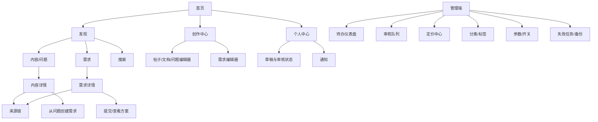
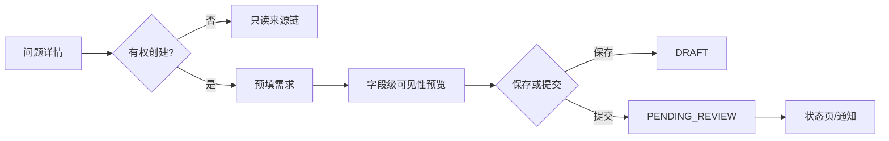

# TechNexus V1 UX 设计文档

文档编号：`DES-UX-001`  
版本：`v1.0`  
状态：`已基线化`  
设计负责人：`产品/UX 负责人`  
目标平台：`technexus-web 与 technexus-admin 响应式 Web，PC 优先`  
原型位置：`本阶段采用本文低保真流程与页面规格；高保真视觉稿不作为 02 阶段卡点`

## 1 体验问题与目标

| 用户问题 | 用户 | 当前证据 | 体验目标 | 衡量方式 |
|---|---|---|---|---|
| 技术讨论难转为可执行需求 | 提问者 | PRD 闭环假设 | 3 分钟内从问题预填需求草稿 | 可用性任务成功率≥80% |
| 审核/定价状态不透明 | 作者/发布者 | PRD 状态机 | 详情页始终显示当前状态、原因和下一步 | 状态理解率≥90% |
| 私密信息可能误公开 | 需求发布者 | FR-DMD-07 | 发布前清晰预览各可见范围 | 高风险误公开=0 |
| 单人运营待办分散 | 审核/运营 | OBJ-003 | 首屏识别待审、待定价、失败、备份异常 | 30 秒内找到首要待办 |
| 内容需要公开发现 | 游客 | NFR-SEO-01 | 公开页有稳定 URL、标题、摘要、来源链 | SEO 技术检查通过 |

## 2 用户与使用情境

| 用户类型 | 目标 | 熟练度 | 设备/环境 | 限制与无障碍需求 |
|---|---|---|---|---|
| 游客 | 搜索可信内容/需求 | 混合 | PC/手机浏览器 | 无登录可读；语义结构 |
| 注册用户/创作者 | 提问、写文档、建需求 | 中 | PC 编辑为主 | 自动保存、键盘操作、错误恢复 |
| 技术服务者 | 筛选需求、提交方案 | 高 | PC/手机 | 隐私边界、截止信息 |
| 审核员/运营 | 批量处理待办 | 高 | PC | 高密度表格、快捷键、不可误操作 |
| 超级管理员 | 权限和配置 | 高 | 受控 PC | 二次确认、重新认证、审计可见 |

## 3 用户研究摘要

- 研究方法：本阶段依据 PRD、发展规划、状态与风险进行专家走查和任务分析，未执行真实用户访谈。
- 样本与限制：无外部样本；所有成功率指标是 04 阶段测试目标，不能当作已验证结果。
- 关键发现：闭环入口必须贴近问题；状态原因和下一步比内部枚举更重要；联系方式/附件需要字段级预览；运营台必须围绕待办而非模块菜单。
- 设计机会：用“来源链”建立可信上下文，用保存草稿/恢复冲突降低长内容编辑风险，用批量结果清单支持单人运营。

## 4 信息架构

应用命名固定为：用户端 `technexus-web`，管理端 `technexus-admin`；二者只通过 `technexus-server` 暴露的 `/api/v1` 契约访问后端。页面路由中的 `/admin` 是 `technexus-admin` 的业务路由，不表示另有未命名工程。

用户端一级导航控制为“发现、需求、创作、通知、我的”；首页仅突出 AI 应用工程、Java/Spring、部署与自托管 3 个方向。管理端按待办优先，并保持独立应用与权限路由。

## 5 用户任务流程

### 5.1 从问题创建需求

- 触发：作者在已发布问题详情点击“转为需求”。
- 成功路径：确认来源 → 自动带入标题/摘要/标签 → 补充技术要求、预算、期限、可见性、联系方式 → 隐私预览 → 保存草稿/提交审核。
- 替代路径：没有问题来源时从需求中心创建；来源无权时不显示入口。
- 中断恢复：每 30 秒或关键字段变化后保存本地草稿；服务端显式“保存草稿”；网络恢复后提示合并。
- 成功状态：显示“已提交审核”、任务编号和预计下一步；来源链立即显示 Problem → Demand 草稿（仅有权用户可见）。

### 5.2 审核员处理任务

- 触发：Dashboard 待审核卡片或审核队列。
- 成功路径：领取 → 并排查看目标版本/历史差异/文件扫描结果/AI 建议 → 选择原因 → 通过或拒绝 → 再次确认 → 查看审计结果。
- 替代路径：版本冲突时禁止决定并刷新；OTHER 强制填写说明；批量操作逐项授权。
- 中断恢复：领取状态可回到队列；输入说明保存在会话草稿；任务已处理时以只读结果替代编辑器。
- 成功状态：明确显示“人工决定已记录”及业务对象新状态，AI 建议不以相同视觉表示。

### 5.3 文件上传

- 成功路径：选择文件 → 本地显示名称/大小 → 获取直传凭证 → 进度 → 上传完成 → 安全扫描 → AVAILABLE 后可绑定。
- 异常：超限在上传前阻断；网络断开可重新发起会话；BLOCKED 展示可理解原因但不泄露扫描规则；SCANNING 不允许提交核心表单。

### 5.4 需求推进与闭环

- 需求详情展示状态时间线和当前允许动作；不同角色只看到有权动作。
- 确认方案、取消、下架均展示影响范围；确认方案需要展示方案摘要，避免按错对象。
- COMPLETED 后出现“关联解决方案/沉淀技术文档”，创建后来源链可视化，V1 不显示订单或付款措辞。

## 6 页面与视图清单

| 页面 | 页面名称 | 用户目标 | 入口 | 关键动作 | 权限 |
|---|---|---|---|---|---|
| UX-P001 | 首页/发现 | 找到核心方向和最新内容 | `/` | 搜索、筛选 | public |
| UX-P002 | 内容列表 | 浏览帖子/文档/问题 | `/contents` | 筛选、排序 | public |
| UX-P003 | 内容详情 | 阅读、评论、查看来源 | `/contents/:id` | 评论、转为需求 | visibility/owner |
| UX-P004 | 内容编辑器 | 创建/修改内容版本 | `/studio/contents/:id?` | 保存、上传、提交 | user:self |
| UX-P005 | 需求列表 | 发现可参与需求 | `/demands` | 排序、筛选 | visibility |
| UX-P006 | 需求详情 | 判断/推进/提交方案 | `/demands/:id` | 方案、状态动作 | participant policy |
| UX-P007 | 需求编辑器 | 创建结构化需求 | `/studio/demands/:id?` | 隐私预览、提交 | user:self |
| UX-P008 | 来源链 | 理解问题到知识关系 | 详情页内嵌/`/lineages/...` | 打开可见节点 | node visibility |
| UX-P009 | 搜索 | 跨域发现 | `/search` | 关键词/类型 | public |
| UX-P010 | 我的草稿/状态 | 跟进审核与冲突 | `/me/work` | 继续编辑、撤回 | user:self |
| UX-P011 | 通知 | 查看状态变化 | `/notifications` | 标记已读 | user:self |
| UX-A001 | 运营 Dashboard | 识别最高优先待办 | `/admin` | 打开队列/异常 | operations |
| UX-A002 | 审核队列/详情 | 人工审核 | `/admin/audits` | 领取、通过、拒绝 | reviewer scope |
| UX-A003 | 定价中心 | 确认价格 | `/admin/pricing` | 建议价对照、确认 | pricing:manage |
| UX-A004 | 运营管理 | 上下架、标签、消息 | `/admin/operations` | 筛选、批量 | operations |
| UX-A005 | 配置与开关 | 安全修改参数 | `/admin/config` | 校验、二次确认 | config:manage |
| UX-A006 | 失败任务/运行状态 | 定位异步/存储/备份异常 | `/admin/health` | 重放、查看手册 | operations/admin |

## 7 单页面设计说明

### 7.1 UX-P003 内容详情

- 优先级：标题/作者与状态 → 正文 → 来源链 → 附件 → 评论。
- 公开页 SSR 输出 canonical、title、description 和结构化基础元数据；非公开内容返回 noindex。
- 如果存在待审新版本，普通访客只看到 publishedVersion；作者看到“线上版本”和“待审版本”切换。
- 删除父评论显示“该评论已删除”，子回复保持上下文；不把内部审核说明公开。

### 7.2 UX-P007 需求编辑器

- 分区：基本信息、技术要求、预算/期限、附件、可见性与联系方式、来源预览。
- PUBLIC 仍默认隐藏联系方式；每个敏感字段旁显示实际可见角色，提交前用角色标签预览。
- 预算使用字符串金额输入和 CNY，不显示支付/购买文案；平台报价与用户预算分栏。
- 状态冲突返回 409 时保留本地输入，展示差异并让用户复制/合并到新版本。

### 7.3 UX-A001 Dashboard

- 首屏顺序：红色运行异常（备份/存储/失败任务）→ 待审核 → 待定价 → 下架/标签/消息待办。
- 每张卡显示数量、最老等待时间、最后刷新时间和入口；0 状态显示“当前无待办”。
- 颜色不是唯一信号；图标、文字和严重级别同时表达。

### 7.4 UX-A002 审核详情

- 三栏宽屏布局：任务/目标元数据、版本差异与文件结果、决定区。窄屏按此顺序折叠。
- AI 内容固定带“建议”标识和模型/生成时间；人工按钮视觉层级更高，采纳建议仍需填充并点击人工决定。
- 拒绝原因使用固定编码；OTHER 选择后立即要求说明。提交前展示目标版本号，版本已变则禁用按钮。

## 8 状态与反馈

| 场景 | 加载 | 空状态 | 错误 | 权限不足 | 离线/超时 | 恢复 |
|---|---|---|---|---|---|---|
| 列表/搜索 | 骨架+保留过滤 | 给出清除过滤/创建入口 | 页面内问题摘要 | 不显示敏感项 | 保留旧结果并标记 | 重试 |
| 编辑器 | 初始化骨架 | 不适用 | 字段旁+顶部汇总 | 只读或 404 | 本地草稿/未同步标记 | 合并再保存 |
| 上传 | 单文件进度/扫描状态 | 拖放说明 | 文件级原因 | 不生成签名 URL | 可重建上传会话 | 重传 |
| 状态动作 | 按钮 busy 且防重复 | 无可执行动作说明 | 409 显示最新状态 | 隐藏动作+服务端拒绝 | 保留幂等键 | 刷新状态 |
| 管理批量 | 已处理/总数 | 当前无待办 | 成功/失败逐项结果 | 逐项无权 | 未处理项可重试 | 仅重试失败项 |
| AI 建议 | QUEUED/RUNNING | 人工路径提示 | FAILED 原因分类 | 不展示入口 | 不阻断表单 | 手动重试/忽略 |

## 9 交互规则

- 所有交互键盘可达；可见焦点；Dialog 打开后焦点陷阱，关闭回到触发点。
- 危险操作不用浏览器原生 confirm：展示目标、影响、原因输入和二次确认；极高风险重新认证。
- 写操作首次点击即禁用并复用同一 Idempotency-Key；超时后显示“结果未知，正在核对”，先查询状态再允许重试。
- 批量上限 100，操作前显示选中数，完成后保留逐项结果可下载（脱敏）。
- 表单校验不只在提交时；服务端错误映射到字段，未知错误显示 traceId 供排查。

## 10 内容与文案

| 场景 | 文案 | 语气 | 动作标签 | 注意 |
|---|---|---|---|---|
| 提交审核 | 提交后本版本将进入审核，线上版本不会被替换 | 明确 | 提交审核 | 不写“发布成功” |
| AI 建议 | 以下内容由 AI 生成，仅供人工参考 | 克制 | 采纳并编辑/拒绝 | 永远显示建议身份 |
| 私密字段 | 联系方式仅发布者、获授权参与者和管理员可见 | 安全 | 预览可见范围 | PUBLIC≠字段全公开 |
| 需求完成 | 需求已完成，可关联解决方案或沉淀文档 | 正向 | 关联成果 | 不写订单/付款 |
| 409 冲突 | 内容已在其他位置更新，你的输入已保留 | 可恢复 | 查看差异 | 不责备用户 |
| 文件阻断 | 文件未通过安全检查，无法使用 | 中性 | 重新选择文件 | 不泄露检测规则 |

## 11 响应式与多端适配

| 断点 | 导航 | 布局 | 内容优先级 | 输入 | 限制 |
|---|---|---|---|---|---|
| ≥1200px | 顶栏/管理侧栏 | 12 栏；审核三栏 | 全部 | 键鼠 | 管理主目标 |
| 768–1199px | 折叠菜单 | 8 栏/双栏 | 正文和动作优先 | 触控/键鼠 | 表格转卡片 |
| <768px | 底部主导航 | 单栏 | 阅读、状态、主要动作 | 触控 | 管理批量只读提示或简化 |

## 12 可访问性

- 目标以 WCAG 2.2 AA 的核心准则作为实现检查基线；语义 heading/landmark，表单 label/description/error 关联。
- 正文可放大至 200% 不丢功能；触控目标建议≥44×44 CSS px；文本与背景对比至少 4.5:1。
- 状态不用单一颜色；Toast 同时进入可感知 live region，严重错误保持在页面内。
- 编辑器工具栏可键盘操作，预览 Mermaid/公式提供文本标题或替代说明；上传进度有文本百分比。

## 13 设计系统与组件

| 组件 | 变体/状态 | 使用规则 | 令牌 | 开发映射 |
|---|---|---|---|---|
| StatusBadge | neutral/info/warn/success/danger | 状态枚举映射，带文字 | `color.status.*` | `TnStatusBadge` |
| AsyncButton | idle/loading/unknown/success | 内置幂等和结果核对 | `motion.fast` | `TnAsyncButton` |
| VisibilityField | 五级+字段覆盖 | 总览与字段级预览 | `color.privacy.*` | `TnVisibilityField` |
| FileUploader | upload/scan/available/blocked | 不允许跳过扫描 | `space.*` | `TnFileUploader` |
| StateTimeline | `technexus-content`、`technexus-demand`、`technexus-audit` | 显示原因和操作者权限化摘要 | `line.*` | `TnStateTimeline` |
| ReviewPanel | manual+AI suggestion | AI 永远次级且有标签 | `color.ai.*` | `TnReviewPanel` |
| ProblemNotice | field/page/retry | 展示 traceId 与恢复动作 | `color.error.*` | `TnProblemNotice` |

## 14 可用性验证计划

| 任务 | 参与者 | 成功标准 | 当前结果 | 发现 | 调整 |
|---|---|---|---|---|---|
| 从问题创建需求 | 3–5 名目标用户 | ≥80% 无协助完成且理解来源/可见性 | 待 04 | 待验证 | 依据测试迭代 |
| 判断需求字段谁可见 | 3–5 名用户 | ≥90% 正确回答联系方式/附件范围 | 待 04 | 待验证 | 依据测试迭代 |
| 审核拒绝并记录原因 | 1–2 名运营角色 | 30 秒内完成、版本不误判 | 待 04 | 待验证 | 依据测试迭代 |
| 找到失败备份待办 | 1–2 名运营角色 | 30 秒内定位及打开手册 | 待 04 | 待验证 | 依据测试迭代 |

## 15 开发交付

- 交付：页面清单、路由、任务流、状态反馈、响应式、可访问性和组件映射已定义。
- 验收：04 阶段结合 OpenAPI Mock、键盘测试、axe/等价自动检查、真实浏览器和 3–5 名目标用户轻量测试。
- 未决：品牌视觉、高保真稿和真实研究样本不会阻断工程骨架，但 Alpha 邀请前应完成至少一次任务测试。
- 设计走查：内容版本、字段级隐私、人工审核、状态冲突和文件扫描是开发完成后的强制走查场景。

## 16 需求追溯

| 用户故事 | 用户流程 | 页面/组件 | 验收场景 | 状态 |
|---|---|---|---|---|
| US-001/002 | 登录与对象权限 | 登录、全局授权反馈 | AC-003/IDOR | 已覆盖 |
| US-003/004/005 | 创作、版本、评论 | UX-P002~004、Timeline | AC-004 | 已覆盖 |
| US-006/007/008 | 需求、方案、闭环 | UX-P005~008 | AC-001/005/006 | 已覆盖 |
| US-009/010 | 审核、定价 | UX-A002/A003、ReviewPanel | 版本绑定/人工决定 | 已覆盖 |
| US-011 | 文件 | FileUploader | 上传/扫描/授权下载 | 已覆盖 |
| US-012 | 搜索/通知 | UX-P009/P011 | 可见性/排序/已读 | 已覆盖 |
| US-013/014 | 运营与 AI | UX-A001~006 | AC-007 | 已覆盖 |
| US-015 | 单机运行 | UX-A001/A006 | AC-008/010 | 已覆盖 |

## 17 变更记录

| 日期 | 版本 | 变更 | 原因 |
|---|---|---|---|
| 2026-09-14 | v0.1 | 初始 UX 信息架构、关键任务流、页面与状态规格 | 02 设计阶段 |
| 2026-09-14 | v0.2 | 明确用户端、管理端和后端 API 的工程命名及页面归属 | DES-USER-002 |
| 2026-09-14 | v1.0 | 用户通过第 3 轮设计门禁，无修改基线化 | 阶段通过 |
