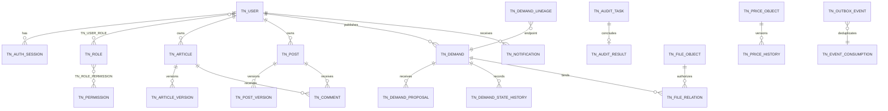

# TechNexus V1 数据库设计文档

文档编号：`DES-DB-001`  
版本：`v1.0`  
状态：`已基线化`  
数据库负责人：`技术负责人`  
数据库产品/版本：`MySQL 8.4 LTS`  
字符集与排序规则：`utf8mb4 / utf8mb4_0900_ai_ci`  
时间约定：`UTC datetime(6)`

## 1 设计范围与数据域

| 数据域 | 所有者模块 | 主要实体 | 数据来源 | 消费者 |
|---|---|---|---|---|
| auth | `technexus-auth` | `tn_auth_credential`、`tn_auth_session` | 用户登录/系统 | `technexus-user`、认证入口 |
| user | `technexus-user` | `tn_user`、`tn_role`、`tn_permission` | 用户/管理员 | 全模块授权端口 |
| community | `technexus-community` | `tn_comment`、`tn_tag`、`tn_notification`、`tn_search_document` | 用户/领域事件 | 用户端、运营 |
| content | `technexus-content` | `tn_article`、`tn_article_version`、`tn_post`、`tn_post_version` | 作者/审核 | 用户端、搜索 |
| demand | `technexus-demand` | `tn_demand`、`tn_demand_proposal`、`tn_demand_lineage`、`tn_demand_state_history` | 发布者/服务者 | 用户端、运营 |
| audit | `technexus-audit` | `tn_audit_task`、`tn_audit_result` | 审核员/业务事件 | 内容、需求、文件 |
| pricing | `technexus-pricing` | `tn_price_object`、`tn_price_history` | 运营 | 内容、需求、审计 |
| file | `technexus-file` | `tn_file_object`、`tn_file_upload_session`、`tn_file_relation` | 用户/对象存储 | 内容、需求 |
| server 与 common | `technexus-server`、`technexus-common` | `tn_system_config`、`tn_feature_flag`、`tn_ai_suggestion`、`tn_outbox_event`、`tn_event_consumption`、`tn_idempotency`、`tn_operation_audit` | 管理员/系统 | 管理端/Worker |

### 1.1 DDD 数据所有权约束

数据库使用一个 MySQL 实例不代表取消限界上下文。所有业务表统一采用 `tn_` 前缀、小写 snake_case、单数名词，禁止使用其他业务域前缀。核心表名必须与用户图片一致：`tn_user`、`tn_role`、`tn_permission`、`tn_article`、`tn_post`、`tn_comment`、`tn_demand`、`tn_audit_task`、`tn_price_object`、`tn_file_object`。

关联、版本和历史表在核心表名后追加单数限定词，例如 `tn_user_role`、`tn_article_version`、`tn_demand_state_history`、`tn_price_history`；表名不使用复数、驼峰、连字符、斜杠或通配符。索引/约束统一为 `pk_<table_without_tn>`、`uk_<table_without_tn>_<purpose>`、`ix_<table_without_tn>_<purpose>`、`fk_<child_without_tn>_<parent_without_tn>`、`ck_<table_without_tn>_<rule>`。

- JPA/JDBC 数据模型位于 `adapter.out.persistence`，领域聚合不使用跨上下文 ORM 关联或懒加载。
- 同上下文强一致关系使用 FK；跨上下文引用只在应用端口传 ID/DTO。V1 同库的少量跨上下文 FK 可用于静态主体完整性，但不得据此直接 join 并修改他域数据。
- Repository 以聚合根为边界，不提供“万能 DAO”；批量报表走只读投影，不把投影对象回写为领域聚合。
- 聚合状态变化、历史和 Outbox 在所属模块的单个应用事务中提交；跨上下文由版本化事件最终一致。
- 表枚举是持久化表示，合法转换仍由领域聚合负责，SQL/Controller 不得自行拼接状态更新绕过不变量。

## 2 概念数据模型

跨域多态关系使用 `target_type + target_public_id`，并由应用服务验证引用；同域强关系使用 FK。多态目标不建立伪 FK，而以清理审计和集成测试保证完整性。

## 3 逻辑数据模型

| 实体 | 业务键 | 属性摘要 | 关系 | 完整性规则 |
|---|---|---|---|---|
| user | public_id/email_normalized | status、password_hash、session_version | auth_session、role | email 唯一；CANCELLED 终态 |
| article/post | public_id | type、state、visibility、published_version_id、version | version、tag、comment | 所有者不因管理操作变化 |
| article_version/post_version | parent_id+revision | title、body、summary、state、checksum | audit target | revision 唯一；发布指针有效 |
| demand | public_id | state、budget、quote、deadline、visibility、version | demand_proposal、history | 金额非负且 min≤max |
| demand_proposal | public_id | provider、plan、quote、state | demand | 每需求/服务者可多修订但仅一个活动方案 |
| audit_task/audit_result | public_id / task_id | target、target_version、state、reason | polymorphic target | 结果追加且目标版本不可空 |
| price_object/price_history | target_type+target_id | mode、final_amount、validity | history | 当前价唯一；历史不可更新 |
| file_object/file_relation | sha256+size / public_id | key、state、owner、visibility | business target | 去重对象不授予关系权限 |
| demand_lineage | source+target+type | endpoint refs | 闭环 | 唯一、禁止自环/环路 |

## 4 物理模型与表清单

数据量是 Alpha 初始护栏内估算，不是业务承诺。

| 表名 | 用途 | 主键 | 初始护栏 | 增长 | 保留期限 |
|---|---|---|---:|---:|---|
| `tn_user` | 用户账号与资料 | bigint | 1,000 | 低 | 活跃期；注销后 30 天去标识，公共作者保留匿名标识 |
| `tn_auth_credential` | 登录凭据 | bigint | 1,000 | 低 | 随用户状态；注销时立即失效 |
| `tn_auth_session` | 会话/刷新 | bigint | 10,000 | 中 | 到期/撤销后 180 天 |
| `tn_role`、`tn_permission`、`tn_user_role`、`tn_role_permission` | RBAC | bigint | 10,000 | 低 | 配置有效期+变更审计永久 |
| `tn_article`、`tn_article_version` | 技术文章及版本 | bigint | 100,000/500,000 | 中 | 已发布版本永久；未发布废弃版本 180 天 |
| `tn_post`、`tn_post_version` | 帖子/问题/解决方案及版本 | bigint | 100,000/500,000 | 中 | 同文章策略 |
| `tn_comment` | 评论 | bigint | 500,000 | 中 | 删除后保留最小 tombstone 维持回复树 |
| `tn_tag`、`tn_article_tag`、`tn_post_tag` | 标签及关系 | bigint | 300,000 | 中 | 合并/禁用后保留别名映射 |
| `tn_demand` | 需求 | bigint | 20,000 | 中 | 关闭后 3 年；联系方式关闭后 180 天清除 |
| `tn_demand_proposal` | 方案 | bigint | 100,000 | 中 | 需求关闭后 3 年 |
| `tn_demand_state_history` | 需求状态历史 | bigint | 300,000 | 中 | 3 年；完成闭环引用摘要长期保留 |
| `tn_demand_lineage` | 来源链 | bigint | 100,000 | 中 | 永久或随两端均彻底删除 |
| `tn_audit_task`、`tn_audit_result` | 审核任务/结果 | bigint | 600,000 | 高 | 审核结果永久（PRD 强制） |
| `tn_price_object`、`tn_price_history` | 当前价/历史 | bigint | 300,000 | 中 | 历史永久（PRD 强制） |
| `tn_file_object` | 对象元数据 | bigint | 300,000 | 中 | 按最后关系；孤儿 30 天清理 |
| `tn_file_upload_session` | 上传会话 | bigint | 100,000 | 高 | TEMP 24 小时；记录 30 天 |
| `tn_file_relation` | 对象级授权 | bigint | 500,000 | 中 | 随业务对象；删除事件后 30 天清理 |
| `tn_notification` | 站内通知 | bigint | 1,000,000 | 高 | 180 天；用户主动删除后 30 天清理 |
| `tn_operation_audit` | 管理/安全操作 | bigint | 1,000,000 | 高 | 在线 1 年，压缩归档至 3 年 |
| `tn_outbox_event` | 异步事件 | bigint | 1,000,000 | 高 | 成功 30 天、失败至关闭后 90 天 |
| `tn_event_consumption` | 事件消费去重记录 | bigint | 1,000,000 | 高 | 成功消费后 30 天 |
| `tn_idempotency` | 幂等响应 | bigint | 200,000 | 高 | 24 小时 |
| `tn_system_config` | 受控系统配置 | bigint | 1,000 | 低 | 当前值长期保留；变更进入操作审计 |
| `tn_feature_flag` | 功能开关与灰度规则 | bigint | 1,000 | 低 | 当前值长期保留；变更进入操作审计 |
| `tn_ai_suggestion` | AI 建议与人工决定 | bigint | 100,000 | 中 | 180 天；采纳结果的变更审计按目标规则 |
| `tn_search_document` | 可重建搜索投影 | bigint | 120,000 | 中 | 随源对象，可全量重建 |

保留期限是工程/隐私基线建议，不构成法律意见；若适用法律、合同或调查保全要求更长，需通过 `legal_hold` 机制阻止清理并留下审批记录。

## 5 表结构定义

以下为阶段二逻辑 DDL 基线；所有表另含 `created_at datetime(6) not null`、`updated_at datetime(6) not null`，可变聚合含 `version bigint not null default 0`。公开 ID 为 `binary(16)` UUIDv7。

### `tn_user` / `tn_auth_credential` / `tn_auth_session`

| 表.字段 | 类型 | 可空 | 说明 | 敏感级别 | 约束 |
|---|---|---|---|---|---|
| tn_user.id | bigint unsigned | 否 | 内部主键 | 普通 | PK |
| tn_user.public_id | binary(16) | 否 | API ID | 普通 | UK |
| tn_user.email_normalized | varchar(254) | 否 | 规范化邮箱 | 个人 | UK、加密备份 |
| tn_user.status | varchar(16) | 否 | REGISTERED/ACTIVE/LOCKED/DISABLED/CANCELLED | 普通 | CHECK |
| tn_user.session_version | bigint unsigned | 否 | 全会话撤销版本 | 普通 | ≥0 |
| tn_auth_credential.user_id | bigint unsigned | 否 | 用户 | 个人 | UK/FK |
| tn_auth_credential.password_hash | varchar(255) | 否 | Argon2id | 机密 | 不记录日志 |
| tn_auth_session.sid | binary(16) | 否 | 会话公开 ID | 敏感 | UK |
| tn_auth_session.user_id | bigint unsigned | 否 | 用户 | 个人 | FK |
| tn_auth_session.refresh_hash | binary(32) | 否 | 带 pepper Hash | 机密 | UK |
| tn_auth_session.status | varchar(16) | 否 | ACTIVE/ROTATED/REVOKED/EXPIRED | 普通 | CHECK |
| tn_auth_session.expires_at | datetime(6) | 否 | UTC 到期 | 普通 | index |

### `tn_article`、`tn_article_version`、`tn_post`、`tn_post_version`、`tn_comment`

| 表.字段 | 类型 | 可空 | 说明 | 敏感级别 | 约束 |
|---|---|---|---|---|---|
| tn_article.public_id、tn_post.public_id | binary(16) | 否 | 外部 ID | 普通 | 各表 UK |
| tn_article.owner_id、tn_post.owner_id | bigint unsigned | 否 | 原始所有者 | 个人 | FK，不因管理操作变更 |
| tn_post.post_type | varchar(16) | 否 | POST/PROBLEM/SOLUTION | 普通 | CHECK |
| tn_article.state、tn_post.state | varchar(24) | 否 | 内容状态机枚举 | 普通 | CHECK |
| tn_article.visibility、tn_post.visibility | varchar(24) | 否 | PUBLIC/LOGIN_REQUIRED/OWNER_ONLY/ADMIN_ONLY | 普通 | CHECK |
| tn_article.published_version_id、tn_post.published_version_id | bigint unsigned | 是 | 当前线上版本 | 普通 | FK，原子更新 |
| tn_article_version.article_id、tn_post_version.post_id | bigint unsigned | 否 | 聚合根 | 普通 | FK |
| tn_article_version.revision、tn_post_version.revision | int unsigned | 否 | 修订号 | 普通 | 各表 UK(parent_id,revision) |
| tn_article_version 与 tn_post_version 的 title、summary、body | varchar/text/longtext | 否/是/否 | 两个版本表的同名字段 | 内容 | 服务端净化 |
| tn_article_version 与 tn_post_version 的 state、checksum | varchar(20)/binary(32) | 否 | 版本状态与 Hash | 普通 | CHECK |
| tn_comment.parent_id、tn_comment.root_id | bigint unsigned | 是 | 原层级 | 普通 | 自 FK |
| tn_comment.target_type、tn_comment.target_public_id | varchar(16)/binary(16) | 否 | ARTICLE 或 POST | 普通 | 应用校验多态目标 |
| tn_comment.display_state | varchar(16) | 否 | VISIBLE/DELETED/BLOCKED | 普通 | 删除保留 tombstone |

### `tn_demand` / `tn_demand_proposal` / `tn_demand_state_history` / `tn_demand_lineage`

| 表.字段 | 类型 | 可空 | 说明 | 敏感级别 | 约束 |
|---|---|---|---|---|---|
| tn_demand.public_id | binary(16) | 否 | 外部 ID | 普通 | UK |
| tn_demand.owner_id | bigint unsigned | 否 | 发布者 | 个人 | FK |
| tn_demand.state | varchar(24) | 否 | 需求状态机枚举 | 普通 | CHECK |
| tn_demand.title/description/requirements | varchar/text/json | 否 | 需求内容 | 内容 | 校验 |
| tn_demand.budget_min/max | decimal(12,2) | 是 | 预算范围 CNY | 敏感 | ≥0 且 min≤max |
| tn_demand.platform_quote/final_quote | decimal(12,2) | 是 | 平台/最终报价 | 敏感 | ≥0 |
| tn_demand.deadline_at | datetime(6) | 是 | UTC 截止 | 普通 | index |
| tn_demand.contact_ciphertext | varbinary(2048) | 是 | 联系方式密文 | 机密 | 应用层信封加密 |
| tn_demand.visibility | varchar(24) | 否 | PRD 五级可见性 | 普通 | CHECK |
| tn_demand_proposal.public_id | binary(16) | 否 | 外部 ID | 普通 | UK |
| tn_demand_proposal.demand_id/provider_id | bigint unsigned | 否 | 需求/服务者 | 个人 | FK |
| tn_demand_proposal.plan/tech_stack | text/json | 否 | 方案 | 内容 | 校验 |
| tn_demand_state_history.from_state/to_state | varchar(24) | 是/否 | 状态历史 | 普通 | 追加写 |
| tn_demand_lineage.source_type/id | varchar(24)/binary(16) | 否 | 来源端 | 普通 | 组合 UK |
| tn_demand_lineage.target_type/id | varchar(24)/binary(16) | 否 | 目标端 | 普通 | 禁止自环 |

### `tn_audit_task` / `tn_audit_result` / `tn_price_object` / `tn_price_history`

| 表.字段 | 类型 | 可空 | 说明 | 敏感级别 | 约束 |
|---|---|---|---|---|---|
| tn_audit_task.public_id | binary(16) | 否 | 任务 ID | 普通 | UK |
| tn_audit_task.target_type/public_id/version_id | varchar/binary/binary | 否 | 绑定业务版本 | 内容 | UK(type,id,version,kind) |
| tn_audit_task.state | varchar(16) | 否 | CREATED/PENDING/PROCESSING/APPROVED/REJECTED/CANCELLED | 普通 | CHECK |
| tn_audit_result.task_id | bigint unsigned | 否 | 审核任务 | 普通 | UK/FK |
| tn_audit_result.decision/reason_code/note | varchar/varchar/text | 否/否/是 | 决定与原因 | 敏感 | OTHER 时 note 必填（应用+CHECK） |
| tn_audit_result.reviewer_id | bigint unsigned | 否 | 审核人 | 个人 | FK |
| tn_price_object.target_type/public_id | varchar/binary | 否 | 定价目标 | 普通 | UK |
| tn_price_object.mode | varchar(24) | 否 | FREE/PAID/PREVIEW/ATTACHMENT_PAID | 普通 | V1 paid 开关关闭 |
| tn_price_object.final_amount | decimal(12,2) | 是 | 最终价格 | 敏感 | ≥0 |
| tn_price_history.before_json/after_json | json | 是/否 | 前后值 | 敏感 | 追加写 |

### `tn_file_object` / `tn_file_upload_session` / `tn_file_relation`

| 表.字段 | 类型 | 可空 | 说明 | 敏感级别 | 约束 |
|---|---|---|---|---|---|
| tn_file_object.public_id | binary(16) | 否 | 对象外部 ID | 普通 | UK |
| tn_file_object.sha256/size_bytes | binary(32)/bigint unsigned | 否 | 服务端校验值 | 普通 | UK(hash,size) |
| tn_file_object.object_key | varchar(512) | 否 | 随机存储 Key | 机密 | UK，不对客户端暴露 |
| tn_file_object.state | varchar(16) | 否 | UPLOADING/UPLOADED/SCANNING/AVAILABLE/BLOCKED/EXPIRED/DELETED | 普通 | CHECK |
| tn_file_object.detected_mime | varchar(127) | 是 | Magic 检测类型 | 普通 | allowlist |
| tn_file_upload_session.expires_at | datetime(6) | 否 | 默认 24h | 普通 | index |
| tn_file_relation.public_id | binary(16) | 否 | 授权关系 ID | 普通 | UK |
| tn_file_relation.file_object_id/owner_id | bigint unsigned | 否 | 对象/关系所有者 | 个人 | FK |
| tn_file_relation.target_type/public_id | varchar/binary | 是 | 业务绑定 | 普通 | 绑定后不可换目标 |
| tn_file_relation.visibility | varchar(24) | 否 | 关系级可见性 | 普通 | CHECK |

### `tn_outbox_event`、`tn_event_consumption`、`tn_idempotency`、`tn_system_config`、`tn_feature_flag`、`tn_operation_audit`

| 表.字段 | 类型 | 可空 | 说明 | 敏感级别 | 约束 |
|---|---|---|---|---|---|
| tn_outbox_event.event_id | binary(16) | 否 | 事件 ID | 普通 | UK |
| tn_outbox_event.aggregate_type/id | varchar/binary | 否 | 事件源 | 普通 | index |
| tn_outbox_event.event_type/schema_version | varchar/smallint | 否 | 契约类型/版本 | 普通 |  |
| tn_outbox_event.payload | json | 否 | 最小事件载荷 | 敏感 | 不含联系方式 |
| tn_outbox_event.status/attempt/next_attempt_at | varchar/int/datetime | 否 | 投递状态 | 普通 | index |
| tn_event_consumption.consumer_name/event_id | varchar(64)/binary(16) | 否 | 消费者与事件 | 普通 | 组合 UK，幂等去重 |
| tn_event_consumption.consumed_at | datetime(6) | 否 | 成功消费 UTC 时间 | 普通 | index |
| tn_idempotency.actor_id/key | bigint/varchar(128) | 否 | 主体+键 | 敏感 | UK(actor,method,path,key) |
| tn_idempotency.request_hash | binary(32) | 否 | 请求摘要 | 普通 | 不保存秘密正文 |
| tn_system_config.config_key/value_json | varchar(128)/json | 否 | 配置键和值 | 敏感 | config_key UK；敏感项仅存 Secret 引用 |
| tn_system_config.version | bigint unsigned | 否 | 乐观锁版本 | 普通 | ≥0 |
| tn_feature_flag.flag_key/enabled/rule_json | varchar(128)/boolean/json | 否/否/是 | 开关与灰度规则 | 普通 | flag_key UK；默认关闭 |
| tn_operation_audit.actor_id/action/target | bigint/varchar/json | 是/否/否 | 操作事实 | 敏感 | 追加写、脱敏 |

## 6 主键、外键与约束

| 约束 | 表 | 类型 | 字段 | 规则 | 删除/更新 |
|---|---|---|---|---|---|
| uk_user_email | tn_user | UK | email_normalized | 账号唯一 | RESTRICT |
| uk_article_version_revision | tn_article_version | UK | article_id,revision | 文章修订唯一 | CASCADE（仅硬删聚合时） |
| uk_post_version_revision | tn_post_version | UK | post_id,revision | 帖子修订唯一 | CASCADE（仅硬删聚合时） |
| fk_article_published_version | tn_article | FK | published_version_id | 必须属于同 article（应用验证） | SET NULL |
| fk_post_published_version | tn_post | FK | published_version_id | 必须属于同 post（应用验证） | SET NULL |
| uk_audit_task_target_version | tn_audit_task | UK | kind,target_type,target_id,target_version_id | 同版本同类一次活动任务 | RESTRICT |
| uk_price_object_target | tn_price_object | UK | target_type,target_public_id | 一个当前价 | RESTRICT |
| uk_file_object_digest | tn_file_object | UK | sha256,size_bytes | 物理去重 | RESTRICT |
| uk_demand_lineage_edge | tn_demand_lineage | UK | source_type,source_id,target_type,target_id,type | 来源关系唯一 | RESTRICT |
| ck_demand_budget | tn_demand | CHECK | budget_min,budget_max | 非负且 min≤max | RESTRICT |

## 7 索引设计

| 索引 | 表 | 字段顺序 | 类型 | 支持查询 | 写入影响 |
|---|---|---|---|---|---|
| ix_article_feed | tn_article | state,visibility,pinned_rank desc,published_at desc,public_id | BTREE | 公开文章流游标 | 中 |
| ix_post_feed | tn_post | state,visibility,pinned_rank desc,published_at desc,public_id | BTREE | 帖子/问题流游标 | 中 |
| ix_article_version_text | tn_article_version | title,summary,body | FULLTEXT | 文章搜索 | 高，异步投影可替代 |
| ix_post_version_text | tn_post_version | title,summary,body | FULLTEXT | 帖子搜索 | 高，异步投影可替代 |
| ix_demand_public | tn_demand | state,visibility,deadline_at,public_id | BTREE | 公开需求/过期 | 中 |
| ix_demand_budget | tn_demand | state,budget_max,public_id | BTREE | 预算排序 | 中 |
| ix_audit_task_queue | tn_audit_task | state,priority desc,created_at,public_id | BTREE | 审核待办 | 中 |
| ix_outbox_event_due | tn_outbox_event | status,next_attempt_at,id | BTREE | Worker 批取 | 中 |
| ix_notification_user | tn_notification | recipient_id,read_at,created_at desc,id | BTREE | 用户通知 | 中 |
| ix_file_upload_session_expiry | tn_file_upload_session | state,expires_at,id | BTREE | TEMP 清理 | 低 |

## 8 查询与访问模式

| 场景 | 访问模式 | 估计频率 | 目标耗时 | 预计行数 | 证据计划 |
|---|---|---:|---:|---:|---|
| 公开内容流 | 覆盖索引+游标 | 4 QPS | P95≤100ms SQL | ≤51 | 04 EXPLAIN ANALYZE |
| 搜索 | tn_search_document/FULLTEXT+权限过滤 | 2 QPS | P95≤300ms SQL | ≤51 | 04 搜索基准 |
| 审核队列 | 状态/优先级索引 | 1 QPS | P95≤100ms | ≤101 | 04 EXPLAIN |
| 需求详情 | public_id + 有界子查询 | 2 QPS | P95≤100ms | ≤100 | 集成测试 |
| 过期任务 | 状态+deadline 分批 | 每分钟 | 每批≤2s | 500 | 定时任务测试 |

## 9 事务与一致性

- 隔离级别 `READ COMMITTED`；聚合更新携带 `version`，影响行数为 0 返回 409。
- 审核结果、价格历史、状态历史和业务 Outbox 与当前模块状态在同一事务提交。
- 审核决定不跨表库直接更新目标模块；通过带 target_version 的命令/事件应用，版本冲突不重试决定。
- 幂等表在业务事务内领取键；同键同请求返回原响应，同键不同 Hash 返回 409。
- 追加写历史表禁止业务 UPDATE/DELETE；仅归档作业账户可按已确认保留策略执行。

## 10 分区、分片与归档

V1 不分库分表。超过 100 万行且维护收益经 EXPLAIN/压测证明后，优先按时间对 `tn_operation_audit`、`tn_notification`、`tn_outbox_event` 归档；业务实体保持单表。归档采用“复制 → 行数/Hash 校验 → 标记清理批次 → 延迟删除”，每批≤5,000，支持暂停。

## 11 数据生命周期与隐私

| 数据类 | 保留/删除规则 | 脱敏/匿名化 | 例外 |
|---|---|---|---|
| 账号资料 | 注销请求确认后 30 天内去标识；认证凭据立即失效 | 邮箱/手机号替换为不可逆占位，公共作者显示“已注销用户” | 安全调查 legal hold |
| 公开内容 | 业务有效期；软删 30 天后清正文，保留最小 tombstone/来源链 | owner 映射匿名主体 | PRD 审核/来源证据 |
| 需求/方案 | 终态后 3 年；联系方式在终态 180 天后清除 | 联系方式加密、列表永不返回 | 争议/合同要求 |
| 审核结果 | 永久 | 页面按权限展示；归档可脱敏审核员展示名 | PRD FR-AUD-02 |
| 价格历史 | 永久 | 操作者 ID 受限展示 | PRD FR-PRC-02 |
| 操作/安全审计 | 在线 1 年，压缩归档至 3 年后删除 | actor/ip/user-agent 脱敏或前缀化 | 安全调查 legal hold |
| Session | 到期/撤销后 180 天删除 | 仅 Hash，不保存 Token | 安全调查 |
| TEMP 上传 | 24 小时过期，物理对象 24 小时内清理；会话记录 30 天 | 文件名净化 | 扫描取证 hold |
| 正式文件 | 随最后一个业务关系；关系全删后 30 天物理清理 | 对象 Key 不外露 | 审核/调查 hold |
| 通知/AI 建议 | 180 天；删除后 30 天清理 | AI 输入最小化、180 天清理 | 采纳产生的业务审计按目标规则 |
| 备份 | 30 个每日恢复点；每月恢复点 12 个 | 全量加密 | legal hold/灾难处理中暂停轮转 |

删除任务使用不可变清理批次记录 `policy_version, cutoff, counts, hash, approver, result`；备份中的已删除数据随轮转过期，不做危险的就地改写。该方案关闭 `REQ-ISSUE-003` 的设计缺口，但必须由用户在本阶段卡点确认后才基线化。

## 12 用户、角色与权限

| 数据库账户 | 用途 | 权限 | 范围 | 凭据 | 审计 |
|---|---|---|---|---|---|
| `tn_app` | 在线应用 | 指定 schema DML，无 DDL/FILE | 业务表 | Secret 注入、轮换 | 连接/异常 |
| `tn_migrate` | Flyway | DDL/DML | 迁移窗口 | 独立短期凭据 | 全记录 |
| `tn_backup` | 逻辑/物理备份 | 最小备份权限 | 指定库 | 独立凭据 | 备份清单 |
| `tn_readonly` | 诊断 | SELECT（屏蔽敏感视图） | 只读视图 | 临时授权 | 查询审计 |

## 13 备份、恢复与容灾

| 数据集 | Alpha RPO | Alpha RTO | 备份方式 | 恢复验证 | 异地策略 |
|---|---:|---:|---|---|---|
| MySQL | ≤24h | ≤4h | 每日一致性备份+binlog（若资源允许） | 每月自动校验、上线前完整恢复 | 每日加密复制到非同主机 |
| 对象存储 | ≤24h | ≤8h | 增量对象同步+版本清单 | 月度抽样下载/Hash | 非同主机 S3/磁盘 |
| 配置/密钥清单 | ≤24h | ≤2h | 加密配置备份；密钥另行托管 | 季度演练 | 离线加密副本 |

备份使用 AES-256-GCM 或等价方式、独立密钥、SHA-256 清单。任何“备份成功”必须同时满足命令成功、文件非空、Hash 记录、异地复制成功；04 阶段完成一次隔离环境恢复，否则 `ARCH-RISK-001` 阻断真实用户上线。

## 14 迁移与回滚

| 迁移 | 变更 | 兼容策略 | 锁风险 | 回滚/前滚 |
|---|---|---|---|---|
| MIG-001 | 初始 schema | Flyway versioned | 无存量 | 删除测试 schema；生产只前滚 |
| MIG-002+ | 新增可空列/表/索引 | expand → deploy → backfill → contract | 索引中 | 先停作业，优先修复前滚 |
| DATA-* | 数据回填 | 游标分批、断点、计数校验 | 低 | 批次标识反向补偿 |

生产禁止自动 destructive migration；删除列至少跨两个发布版本，先停止读写并验证查询/代码无引用。

## 15 容量规划与监控

- 告警：磁盘≥80%、连接池等待 P95>100ms、慢 SQL>100ms 比率>1%、死锁>0、备份年龄>26h、binlog/归档失败。
- 预留：MySQL 数据+索引预计使用分区不超过 60%，备份临时空间至少一个完整备份大小。
- 迁移触发：可搜索对象>500,000、核心表>5,000,000、搜索 P95>500ms 连续 7 天或 Alpha 护栏两次越界，进入容量 ADR 复查。

## 16 数据需求追溯

| 表/字段 | 关联需求 | 关联 API | 关联测试 |
|---|---|---|---|
| `tn_user`、`tn_auth_credential`、`tn_auth_session`、`tn_role`、`tn_permission` | FR-ACC、FR-RBAC | API-AUTH、API-ADMIN | 会话/权限矩阵 |
| `tn_article`、`tn_article_version`、`tn_post`、`tn_post_version`、`tn_comment`、`tn_tag` | FR-CNT、FR-CAT | API-CNT | 版本/审核/评论测试 |
| `tn_demand`、`tn_demand_proposal`、`tn_demand_lineage`、`tn_demand_state_history` | FR-DMD、FR-LOOP | API-DMD、API-LINEAGE | 状态/闭环测试 |
| `tn_audit_task`、`tn_audit_result` | FR-AUD | API-AUD | 版本错位/永久结果 |
| `tn_price_object`、`tn_price_history` | FR-PRC | API-PRC | 金额/历史/权限 |
| `tn_file_object`、`tn_file_upload_session`、`tn_file_relation` | FR-FILE | API-FILE | 文件安全/IDOR |
| `tn_search_document`、`tn_notification`、`tn_system_config`、`tn_feature_flag`、`tn_ai_suggestion` | FR-SCH、RCM、MSG、AIOPS、CFG | API-SCH、MSG、OPS、AI | 投影/批量/人工确认 |
| UTC/version/outbox | NFR-TIME、CON、DAT | 全部写 API | 并发/重放/时间测试 |

## 17 变更记录

| 日期 | 版本 | 变更 | 原因 |
|---|---|---|---|
| 2026-09-14 | v0.1 | 初始数据库设计与数据生命周期方案 | 02 阶段关闭 REQ-ISSUE-003 |
| 2026-09-14 | v0.2 | 明确 MySQL 共享实例下的 DDD 数据所有权、Repository 聚合边界、ORM/FK 和迁移约束 | DES-USER-001 |
| 2026-09-14 | v0.3 | 全部数据库表、约束、索引和追溯统一为 `tn_` 小写 snake_case 单数命名，核心表采用用户指定名称 | DES-USER-002 |
| 2026-09-14 | v1.0 | 用户通过第 3 轮设计门禁，无修改基线化 | 阶段通过 |
