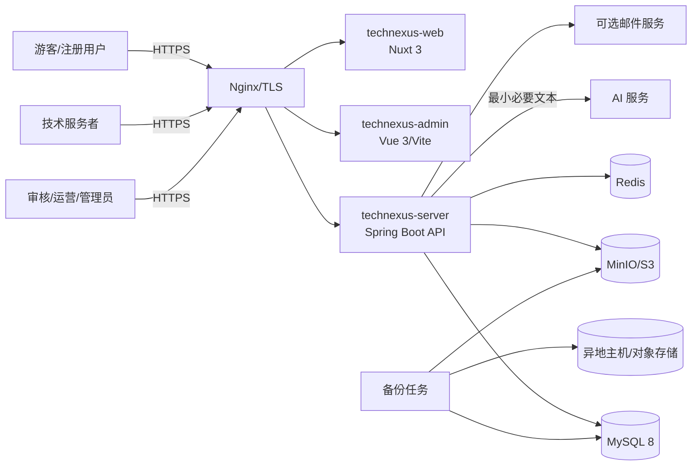
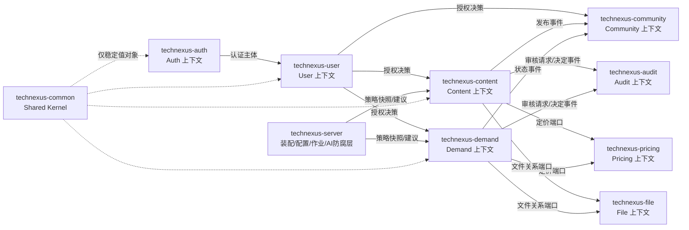
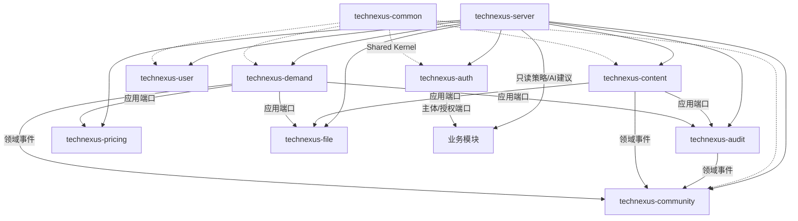
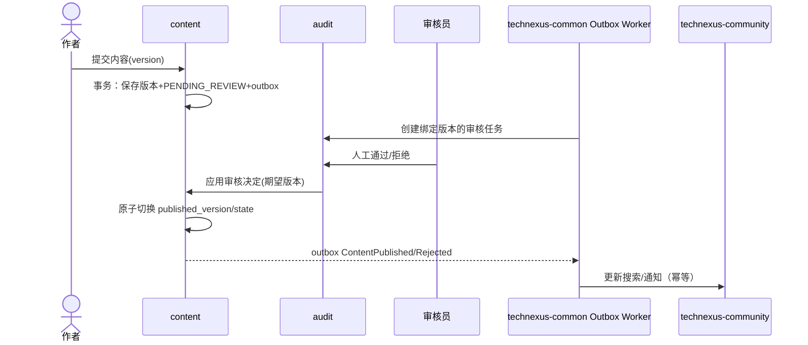
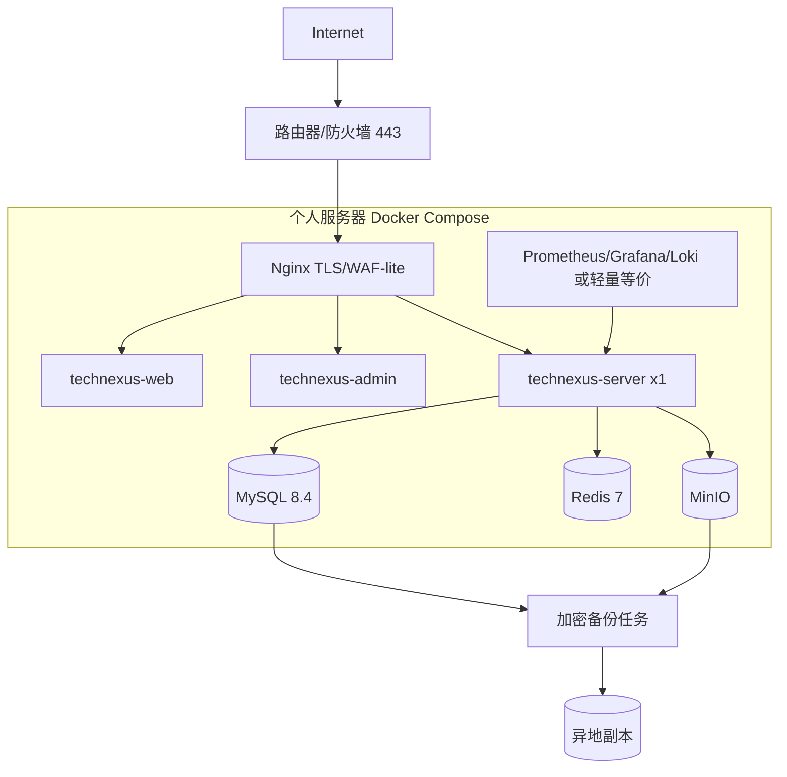

# TechNexus V1 架构设计文档

文档编号：`DES-ARCH-001`  
版本：`v1.0`  
状态：`已基线化`  
架构负责人：`技术负责人`  
需求基线：`REQ-SRS-001@v1.0`

## 1 架构目标与范围

- 业务目标：支撑 `OBJ-001` 至 `OBJ-005`，优先验证 Problem → Demand → Solution/Knowledge 闭环。
- 架构目标：单人可维护、核心事实可恢复、权限默认拒绝、支持个人服务器 Alpha，并保留横向扩展路径。
- 设计范围：用户端、管理端、Spring Boot 模块化单体、MySQL、Redis、对象存储、AI 适配、备份与可观测性。
- 排除范围：支付/订单、购买权益、复杂 IM、视频转码、微服务、Kubernetes、商业级多活。

### 1.1 后端架构结论

后台明确采用 **Java 21 LTS + Spring Boot 3 模块化单体 + 领域驱动设计（DDD）+ 端口与适配器架构**。Spring Boot 是运行和集成框架，DDD 负责业务边界与模型，二者不是互相替代的概念。

具体约束如下：

1. 以限界上下文划分业务模块，不按 Controller/Service/DAO 建立一个全局三层大包。
2. 核心业务规则落在聚合、实体、值对象、领域服务和领域事件中；应用服务只负责编排、事务、授权入口和端口调用。
3. 每个限界上下文内部采用 `adapter.in → application → domain ← adapter.out`；领域层不依赖 Spring Web、JPA 实体或外部 SDK。
4. 跨上下文只通过公开应用接口、稳定值对象/DTO 或领域事件通信；禁止共享聚合对象和跨模块 Repository/Mapper。
5. 使用 Spring Security 实现入站认证，但对象级授权由应用层策略端口执行；使用 Spring Data/JDBC/JPA 的实现只能位于持久化适配器。
6. 使用 ArchUnit，并优先结合 Spring Modulith 的模块验证能力，保证依赖方向和模块边界在 CI 中可执行验证。

该结论是阶段三的工程约束，不是“可选参考”。简单查询和后台报表可以使用轻量 CQRS 查询模型，但不得绕过写侧聚合不变量。

### 1.2 工程与命名基线

工程/模块名严格使用以下集合，不创建列表以外的同级工程：

| 工程名 | 类型 | 责任 |
|---|---|---|
| `technexus-web` | 前端应用 | 用户公开端与登录后用户端，Nuxt 3/Vue 3/TypeScript |
| `technexus-admin` | 前端应用 | 管理端，Vue 3/TypeScript/Vite |
| `technexus-server` | 后端启动/装配模块 | Spring Boot 启动、HTTP 装配、配置、作业、AI 防腐适配和运行入口 |
| `technexus-common` | 后端公共模块 | 仅稳定 Shared Kernel 与通用技术端口；不得放业务实体 |
| `technexus-auth` | 后端业务模块 | 凭据、登录、会话、Token、认证限流 |
| `technexus-user` | 后端业务模块 | 用户、角色、权限、用户资料与授权策略 |
| `technexus-community` | 后端业务模块 | 评论、标签、搜索投影、通知、推荐和社区互动预留 |
| `technexus-content` | 后端核心模块 | 文章、帖子、问题、解决方案及版本 |
| `technexus-demand` | 后端核心模块 | 需求、方案、状态历史和来源链 |
| `technexus-audit` | 后端支撑模块 | 统一审核任务与永久审核结果 |
| `technexus-pricing` | 后端支撑模块 | 定价对象、当前价格与不可变价格历史 |
| `technexus-file` | 后端通用模块 | 文件对象、上传会话、扫描、关系授权和下载 |

Java 根包固定为 `com.technexus`；各后端模块的直接子包使用工程名去掉 `technexus-` 后的名称，例如 `technexus-demand → com.technexus.demand`。数据库命名固定为 `tn_` 前缀、小写 snake_case、单数业务名，核心表按用户规范原样采用 `tn_user`、`tn_role`、`tn_permission`、`tn_article`、`tn_post`、`tn_comment`、`tn_demand`、`tn_audit_task`、`tn_price_object`、`tn_file_object`。

## 2 干系人与关注点

| 干系人 | 关注点 | 架构视角 | 验证方式 |
|---|---|---|---|
| 用户/服务者 | 隐私、可用性、状态透明 | 上下文、运行时、安全 | UX、权限、状态机测试 |
| 审核/运营 | 待办效率、人工决定、可审计 | 逻辑、数据、运维 | 管理端演示、审计查询 |
| 单人开发者 | 可维护、低运维成本、可恢复 | 模块、部署、演进 | 架构测试、恢复演练 |
| 产品负责人 | PRD 闭环、V1/P1 边界 | 需求映射 | 追溯检查、验收 |

## 3 架构驱动因素

| 编号 | 类型 | 驱动因素 | 优先级 | 架构影响 |
|---|---|---|---|---|
| AD-001 | 业务 | 问题到知识闭环 | 高 | 统一来源关系与状态历史 |
| AD-002 | 约束 | 一人公司和个人服务器 | 高 | 模块化单体、Compose、少中间件 |
| AD-003 | 安全 | 对象级权限、私有附件、人工高风险决定 | 高 | 策略授权、短期签名 URL、审计 |
| AD-004 | 数据 | MySQL 是唯一业务事实源 | 高 | Redis 可丢弃；Outbox 与业务同事务 |
| AD-005 | 质量 | 公开内容 SEO 与 PC 优先、移动可用 | 高 | 用户端采用 Nuxt 3 SSR/SSG；管理端 SPA |
| AD-006 | 演进 | 10 万注册用户、300 QPS 短峰值不受阻 | 中 | 无状态应用、对象存储、模块可拆分 |

## 4 系统上下文视图

| 外部对象 | 关系 | 协议 | 数据 | 信任级别 |
|---|---|---|---|---|
| 浏览器 | 使用平台 | HTTPS/JSON | 内容、需求、管理操作 | 不可信输入 |
| MinIO/S3 | 保存对象 | S3/HTTPS | 文件对象 | 受控基础设施 |
| AI 服务 | 生成建议 | HTTPS/JSON | 脱敏后的必要文本 | 第三方低信任 |
| 异地备份目标 | 灾备副本 | TLS | 加密备份 | 受控外部边界 |

浏览器、AI 服务、对象存储直传入口均跨越信任边界；任何来自这些边界的数据都重新鉴权和校验。

## 5 逻辑架构视图

### 5.1 DDD 限界上下文映射

| 限界上下文 | 核心/支撑/通用域 | 聚合根 | 上下游关系 | 防腐/集成方式 |
|---|---|---|---|---|
| Auth / `technexus-auth` | 通用域 | AuthSession、Credential | 向 User 提供认证主体 | `AuthenticatedPrincipal` DTO，不共享凭据实体 |
| User / `technexus-user` | 通用域 | User、Role | 向业务模块提供资料与授权决策 | `AuthorizationDecision` DTO；Permission 属于 Role 聚合 |
| Community / `technexus-community` | 支撑域 | Comment、Tag | 消费 Content/Demand 事件 | 搜索/通知为可重建投影，不作为聚合根且不回写核心聚合 |
| Content / `technexus-content` | 核心域 | Article、Post | 消费 User/File/Audit/Pricing；发布内容事件 | 应用端口+Outbox；版本 ID 是审核契约 |
| Demand / `technexus-demand` | 核心域 | Demand、Proposal、Lineage | 消费 User/File/Audit/Pricing；发布需求事件 | 应用端口+Outbox；不引入 Order |
| Audit / `technexus-audit` | 支撑域 | AuditTask | Content/Demand/File 的下游审核 | target reference + immutable version；回调应用命令 |
| Pricing / `technexus-pricing` | 支撑域 | PriceObject | Content/Demand 的下游定价 | TargetRef+Money；历史追加写 |
| File / `technexus-file` | 通用域 | FileObject、FileRelation | 为 Content/Demand 提供安全对象能力 | FileAccessPort；不理解正文/需求规则 |

上下文映射采用“明确客户/供应者 + 发布语言”关系：上游事件和 DTO 必须带版本；Shared Kernel 仅限 UUID、UTC 时间、Money、错误和事件 envelope，禁止把用户、内容或需求实体放入公共包。

| 组件 | 职责 | 对外接口 | 依赖 | 数据所有权 |
|---|---|---|---|---|
| `technexus-auth` | 凭据、登录、会话、Token | `/auth`、认证主体端口 | `technexus-user` | `tn_auth_credential`、`tn_auth_session` |
| `technexus-user` | 用户、角色、权限、资料与授权策略 | `/me`、授权端口 | `technexus-common` | `tn_user`、`tn_role`、`tn_permission` |
| `technexus-community` | 评论、标签、搜索、通知、推荐 | `/search`、`/notifications`、评论接口 | 领域事件 | `tn_comment`、`tn_tag`、`tn_notification` |
| `technexus-content` | 文章、帖子、问题、方案内容及版本 | `/contents`、领域事件 | `technexus-auth`、`technexus-user`、`technexus-file`、`technexus-audit`、`technexus-pricing` 公开端口 | `tn_article`、`tn_post` 及版本表 |
| `technexus-demand` | 需求、方案、闭环关系、状态 | `/demands`、`/lineages` | `technexus-user`、`technexus-file`、`technexus-audit`、`technexus-pricing` 公开端口 | `tn_demand`、`tn_demand_proposal`、`tn_demand_lineage` |
| `technexus-audit` | 统一审核和永久结果 | `/admin/audit-tasks` | `technexus-user` | `tn_audit_task`、`tn_audit_result` |
| `technexus-pricing` | 定价对象与不可变历史 | `/admin/prices` | `technexus-user` | `tn_price_object`、`tn_price_history` |
| `technexus-file` | 上传会话、扫描、关系、授权下载 | `/files` | `technexus-user`、对象存储 | `tn_file_object`、`tn_file_relation` |
| `technexus-server` | 启动装配、配置/开关、任务、AI 防腐适配 | `/admin/config`、`/admin/dashboard`、AI 接口 | 全模块公开 API | `tn_system_config`、`tn_feature_flag`、`tn_ai_suggestion` |
| `technexus-common` | Shared Kernel、Outbox/幂等技术契约 | 无业务 HTTP 接口 | 无业务模块 | `tn_outbox_event`、`tn_idempotency` |

依赖规则：同模块内按 `api → application → domain ← infrastructure`；跨模块只能调用公开应用端口或消费事件，禁止跨模块访问 Repository/Mapper，禁止 Web 层绕过应用服务。

## 6 运行时视图

### 6.1 内容发布与审核

事务内只写本模块数据和 Outbox；跨模块投递至少一次，消费者以 `event_id` 去重。失败指数退避，超过阈值进入失败任务待办，不自动越过人工决定。

### 6.2 降级顺序

1. AI 不可用：保留人工流程，不重试用户请求内的生成动作。
2. Redis 不可用：限流采取本地保守阈值，缓存回源 MySQL；不改变业务状态。
3. 对象存储不可用：禁止新上传，已有文本业务可用，管理端告警。
4. MySQL 不可用：健康检查失败，停止写请求，不用缓存伪造成功。

## 7 数据架构视图

- 核心域：身份、内容、需求、审核、定价、文件、消息、运营配置。
- 主数据：用户、角色权限、分类/标签、系统参数；各模块拥有其写模型。
- 一致性：模块内本地事务；跨模块 Outbox 最终一致；状态、价格和审核历史追加写。
- 缓存：Redis 仅存会话状态缓存、限流桶、幂等结果和热点公开数据，全部可重建。
- 搜索：V1 使用 MySQL FULLTEXT/受控 `LIKE` 和搜索投影；达到 50 万可搜索对象或搜索 P95 连续 7 天超 500 ms 时评估 OpenSearch。
- 时间与 ID：数据库存 UTC `datetime(6)`；外部标识 UUIDv7，内部主键 `bigint unsigned`，API 不暴露连续主键。

## 8 集成架构视图

| 集成点 | 模式 | 同步/异步 | 契约 | 容错 | 所有者 |
|---|---|---|---|---|---|
| Web 客户端 | REST | 同步 | OpenAPI 3.1 | 超时、限流、问题详情 | API |
| 对象上传 | 预签名 URL | 同步 | upload-session | 过期、Hash/MIME 校验 | file |
| AI 建议 | 适配器 API | 同步触发、后台执行 | ai-suggestion | 超时、熔断、人工降级 | `technexus-server` AI 防腐适配器 |
| 模块事件 | DB Outbox | 异步 | versioned event envelope | 至少一次、去重、重试 | 事件产生者 |
| 异地备份 | 加密文件 | 异步批处理 | 清单+SHA-256 | 重试、校验、告警 | ops |

V1 不引入独立 MQ。并发或延迟达到单进程 Outbox 无法满足（待处理 >10,000 或 P95 延迟 >60 秒持续 30 分钟）时，再以相同事件契约接入消息中间件。

## 9 部署架构视图

公网仅开放 443；数据库、Redis、MinIO 管理口只在私网/Compose 网络。密钥通过环境/挂载文件注入且不入库。Alpha 单实例允许维护窗口；后续通过无状态 API 多副本、外置数据库/Redis/对象存储演进。

## 10 安全架构

- 认证：短时 Access JWT（默认 15 分钟）+ 单次轮换 opaque Refresh Token（默认 30 天），Refresh 仅保存带 pepper 的 Hash；Token 参数由后台配置但受安全上下限保护。
- 撤销：JWT 带 `sid`/`session_version`；退出、封禁、重置密码使会话失效，Redis 缓存状态，MySQL 是事实源。
- 授权：RBAC 表达 Resource/Action/Scope，应用服务统一执行功能级与对象级策略；默认拒绝。
- Web：SameSite/HttpOnly/Secure Cookie 保存 Refresh；Access 默认仅内存。状态变更接口校验 Origin/CSRF 双提交令牌。
- 输入：参数白名单、Markdown/富文本服务端净化、参数化 SQL、出站域名白名单阻断 SSRF。
- 文件：预签名仅允许指定 Key/大小；完成回调后校验扩展名、MIME、Magic Number、Hash 和扫描状态，未通过不可绑定或下载。
- 审计：登录、权限、审核、价格、配置、管理员跨所有者操作追加写；日志脱敏，不记录密码、Token、完整手机号/联系方式。
- AI：最小必要输入、去标识化；输出写建议表，无法直写审核、价格、封禁、权限等事实。

## 11 质量属性场景

| 属性 | 刺激源和事件 | 环境 | 期望响应 | 可量化指标 | 设计措施 |
|---|---|---|---|---|---|
| 性能 | Alpha 混合业务负载 | 基线硬件 | 无明显排队/错误 | 10 QPS 持续 15 分钟、20 QPS 突发 5 分钟；普通读 P95≤500ms、热点≤200ms、主要 API P99≤1s、5xx<0.1% | 缓存、索引、连接池、限流 |
| 容量 | 20 个活跃会话并发操作 | Alpha | 核心流程成功 | 注册用户≤1,000、可搜索对象≤100,000、对象存储≤200GB 为初始运行护栏 | 阈值告警、迁移触发器 |
| 可恢复 | 主机/磁盘故障 | Alpha | 从异地副本恢复 | Alpha 设计目标 RPO≤24h、RTO≤4h；上线前演练 | 日备、校验、恢复手册 |
| 安全 | 修改 ID 访问他人资源 | 全环境 | 拒绝且不泄露存在性 | 关键 IDOR 用例 100% 通过 | 策略授权、外部 ID |
| 可维护 | 跨模块变更 | CI | 禁止越层 | ArchUnit 违规 0 | 应用端口、架构测试 |

上述 Alpha 数值是把 PRD 的“低双位数 QPS、几十至几百用户”转成的保守设计护栏，不是硬件实测结论；需在阶段卡点确认，并在 04 阶段于实际服务器验证。

## 12 容量与成本

| 资源 | 初始护栏 | 峰值预测 | 扩展策略 | 成本约束 |
|---|---:|---:|---|---|
| API | 10 QPS 持续/20 突发 | 长期 300 QPS 短峰 | 无状态多副本、模块热点拆分 | Alpha 单进程 |
| 并发活跃会话 | 20 | 长期 500 峰值在线 | 共享 Redis/会话存储 | Alpha 个人服务器 |
| MySQL | 100,000 可搜索对象 | 10 万注册用户规模 | 读副本、托管 MySQL、归档 | 不提前分库 |
| 文件 | 200 GB 护栏，80% 告警 | 按增长监测 | 外置 S3/CDN | 禁止视频上传 |
| 备份 | 30 个每日点 | 数据增长驱动 | 冷存储、增量备份 | 至少一份异地 |

实际服务器 CPU、内存、磁盘类型/IOPS、上行带宽是 04 性能测试的强制环境元数据；若不足以达到上述护栏，先限流和缩小 Alpha 名额，再决定扩容，不降低安全与恢复要求。

## 13 可观测性与运维

- JSON 日志字段：`timestamp, level, trace_id, actor_id_hash, module, event, result, error_code, duration_ms`。
- 指标：HTTP 延迟/错误、JVM、连接池、慢 SQL、Redis 命中、Outbox backlog、扫描失败、磁盘水位、备份年龄/校验。
- 健康：liveness 不访问外部依赖；readiness 检查 MySQL，按写路径策略检查 Redis/对象存储。
- 告警：5xx≥1% 5 分钟、磁盘≥80%、最近成功备份>26 小时、Outbox 最老>5 分钟、扫描服务不可用>10 分钟。
- SLO：Alpha 不承诺公开 SLA；内部以核心 API 月成功率 99% 和已计划维护排除后的观测值作为改进基线。

## 14 架构决策记录索引

| ADR | 决策 | 状态 | 替代方案 | 主要权衡 |
|---|---|---|---|---|
| ADR-001 | Java 21 + Spring Boot 3 模块化单体，采用 DDD 与端口/适配器；ArchUnit/Spring Modulith 验证边界 | 已明确，待用户确认 | 全局三层 CRUD、微服务 | 业务边界清晰且控制运维成本 |
| ADR-002 | 用户端 Nuxt 3 SSR/SSG，管理端 Vue 3/Vite SPA | 提议待确认 | 两端均 SPA | SEO 与复杂度平衡 |
| ADR-003 | MySQL 8.4 为事实源，Redis 仅缓存 | 提议待确认 | NoSQL 主存 | 一致性与可恢复性优先 |
| ADR-004 | DB Outbox + Scheduler，不部署 MQ | 提议待确认 | RabbitMQ/Kafka | 降低 Alpha 运维面 |
| ADR-005 | MinIO/S3 直传、应用保存元数据关系 | 提议待确认 | 应用中转文件 | 减少内存与带宽占用 |
| ADR-006 | 初始容量护栏与 Alpha RPO/RTO | 提议待确认 | 不设绝对值 | 让上线/限流判断可测试 |

## 15 风险、技术债与演进

| 编号 | 类型 | 描述 | 概率 | 影响 | 缓解措施 | 触发复查条件 |
|---|---|---|---|---|---|---|
| ARCH-RISK-001 | 红线候选 | 主机、数据库、对象和网络单点 | 高 | 高 | 异地加密备份、恢复演练 | 真实用户上线前未完成 |
| ARCH-RISK-002 | 风险 | Nuxt SSR 增加一进程和前端复杂度 | 中 | 中 | 仅公开页 SSR，其余按需 CSR | 一人维护成本超预算 |
| ARCH-RISK-003 | 风险 | 无 MQ 时异步吞吐受限 | 低 | 中 | Outbox 水位监控、契约可迁移 | backlog/延迟越阈值 |
| ARCH-RISK-004 | 风险 | AI/扫描外部依赖不可用 | 中 | 中 | 熔断、人工降级、隔离队列 | 连续失败 10 分钟 |
| ARCH-DEBT-001 | 技术债 | MySQL 基础搜索相关度有限 | 中 | 中 | 投影表和迁移触发器 | 规模或 P95 越阈值 |

## 16 需求映射

| 架构元素 | 关联需求/NFR | 支持方式 | 验证证据 |
|---|---|---|---|
| `technexus-auth`、`technexus-user` | FR-ACC、FR-RBAC、SEC-001~006 | 会话撤销、策略授权、默认拒绝 | API/IDOR 测试 |
| `technexus-content`、`technexus-audit` | FR-CNT、FR-AUD | 版本绑定审核、追加结果 | 状态机/并发测试 |
| `technexus-demand`、`technexus-pricing` | FR-DMD、FR-LOOP、FR-PRC | 分域状态与来源链 | 集成/数据测试 |
| `technexus-file` | FR-FILE、NFR-SEC-02 | 直传、扫描、关系授权 | 文件安全测试 |
| `technexus-community`、`technexus-server` | FR-SCH、FR-RCM、FR-MSG、FR-AIOPS、FR-CFG | 投影、待办、人工决定 | UX/集成测试 |
| Compose + backup + observability | NFR-PERF、CAP、AVL、REL、OBS | 限流、备份恢复、指标告警 | 压测/恢复报告 |
| Nuxt public web | NFR-SEO-01、NFR-CMP-01、NFR-ACC-01 | SSR/SSG、响应式、语义化 | SEO/浏览器/a11y 测试 |

### 16.1 精确编号覆盖补充

| 需求编号 | 设计处理 | 验证 |
|---|---|---|
| FR-ACC-04 | P1 注销能力延期；本阶段先锁定匿名主体、30 天去标识与历史引用策略 | 数据生命周期检查 |
| FR-RBAC-02、FR-RBAC-03、FR-RBAC-04 | 应用服务逐接口授权、对象/参与关系策略、管理高风险确认与脱敏审计 | API 权限矩阵、IDOR 测试 |
| FR-CNT-04 | 点赞/收藏按 v1.0 需求基线延期到 P1；V1 不开放 API/入口 | 契约不存在性检查 |
| FR-DMD-05 | Demand 聚合与状态历史不建 Order/Payment/Entitlement 表或接口 | schema/OpenAPI 检查 |
| FR-LOOP-03 | 专家证据主页延期 P1；V1 只保留可扩展来源链 | 范围检查 |
| FR-CAT-01 | 分类/标签归 `technexus-community`，配置入口归 `technexus-server`，首页仅突出 3 个基线方向 | 配置/首页测试 |
| FR-MSG-02 | P1 偏好页面延期；V1 可预留通知偏好表但不开放配置 API | schema/契约检查 |
| NFR-PERF-01、NFR-PERF-02、NFR-PERF-03、NFR-PERF-04、NFR-PERF-05、NFR-PERF-06 | 定义普通/热点/主要 API、5xx、SQL 和分页指标 | 04 压测与 SQL 证据 |
| NFR-CAP-01、NFR-CAP-02 | 定义 Alpha 初始护栏与长期迁移触发器 | 04 基线压测、架构复查 |
| NFR-AVL-01、NFR-AVL-02 | Alpha 允许维护窗口；99.9% 仅正式商业环境目标 | 恢复演练/未来 SLO |
| NFR-REL-01、NFR-REL-02、NFR-REL-03 | 日备、异地副本、Alpha RPO/RTO 与 P1 交易恢复目标分离 | 备份检查/恢复演练 |
| NFR-SEC-01、NFR-SEC-02、NFR-PRI-01 | HTTPS/最小端口、应用/文件威胁防护、最小化和脱敏 | 配置/安全/日志检查 |
| NFR-MNT-01 | 公开应用端口与 ArchUnit 禁止跨模块 Repository | 架构测试 |
| NFR-OBS-01 | Trace ID、HTTP/JVM/SQL/Redis/Outbox/备份指标和告警 | 可观测性演示 |
| NFR-DAT-01 | MySQL 事实源、追加历史、缓存可重建 | 缓存丢失/重放测试 |
| NFR-CON-01 | 乐观锁、幂等表、行锁与 409 | 并发测试 |
| NFR-TIME-01 | MySQL UTC datetime(6)、API RFC3339 UTC、客户端本地显示 | API/数据库检查 |

## 17 变更记录

| 日期 | 版本 | 变更 | 原因 |
|---|---|---|---|
| 2026-09-14 | v0.1 | 初始架构设计，提出 6 项 ADR 与 Alpha 定量护栏 | 02 设计阶段 |
| 2026-09-14 | v0.2 | 明确后台采用 Spring Boot + DDD + 端口/适配器，补充限界上下文、上下游关系和不可绕过的实现约束 | DES-USER-001 |
| 2026-09-14 | v0.3 | 按用户图片统一 12 个工程名、`com.technexus` 根包和 `tn_` 数据库命名，重构上下文与组件映射 | DES-USER-002 |
| 2026-09-14 | v1.0 | 用户通过第 3 轮设计门禁，无修改基线化 | 阶段通过 |
