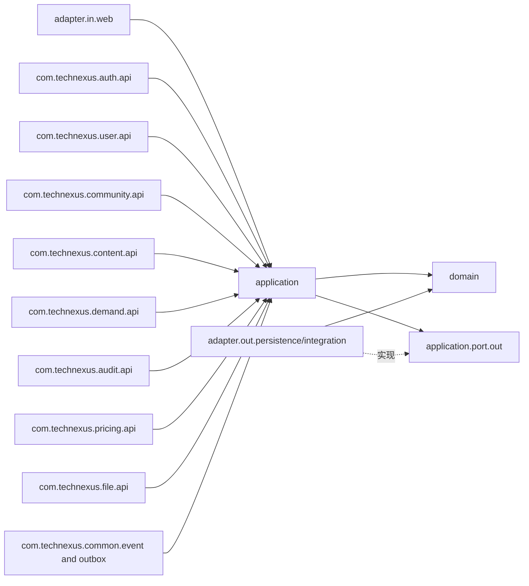
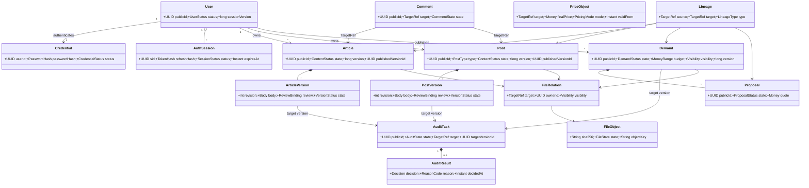
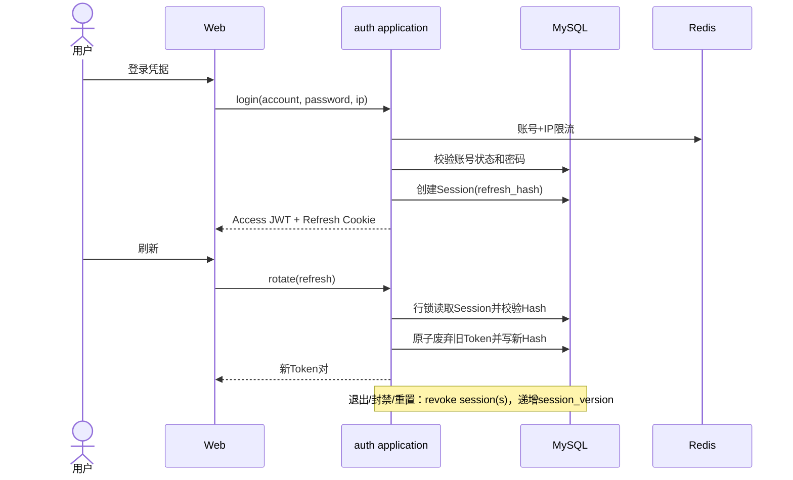
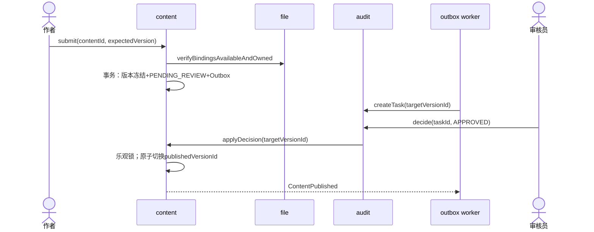
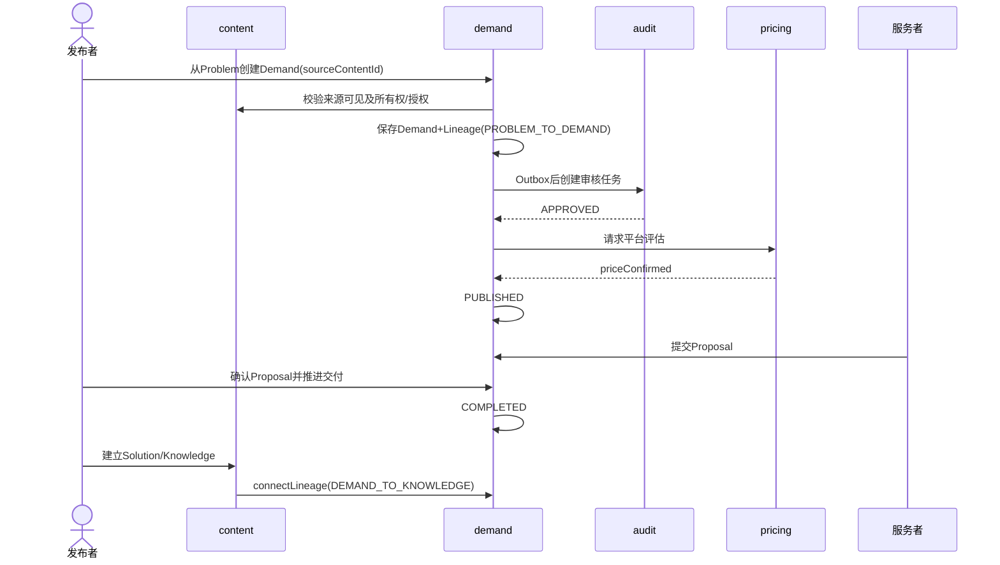
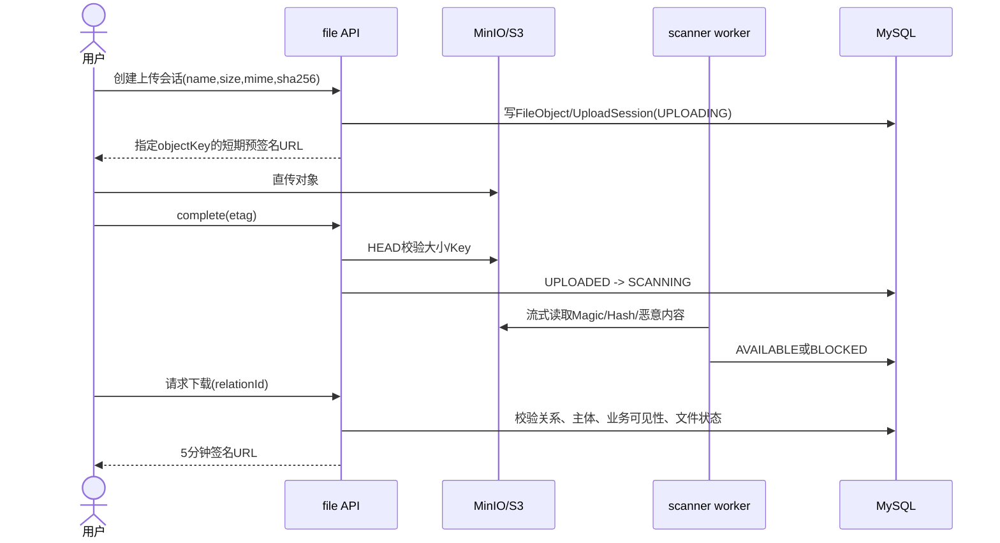
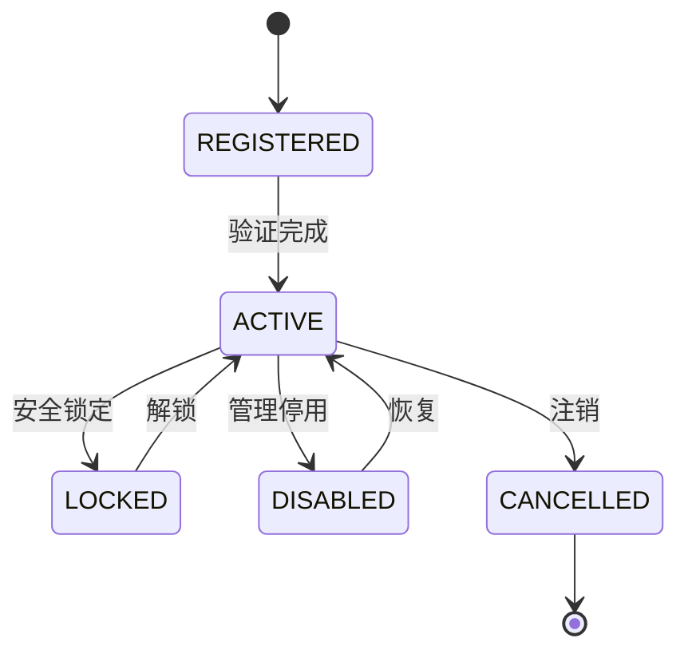
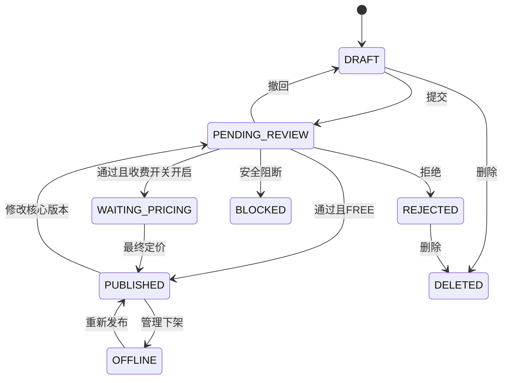
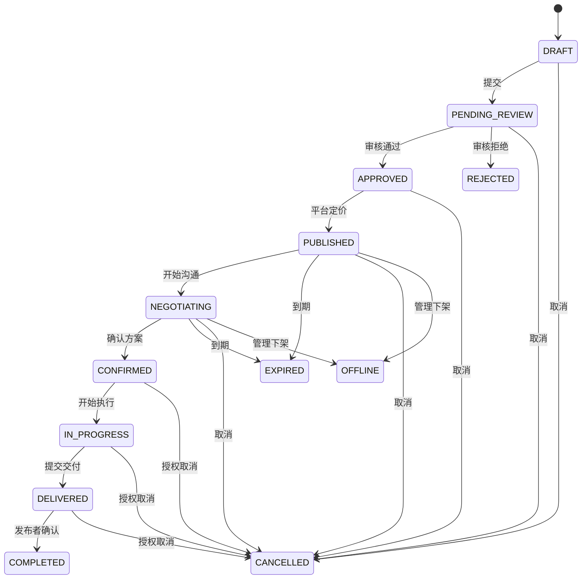
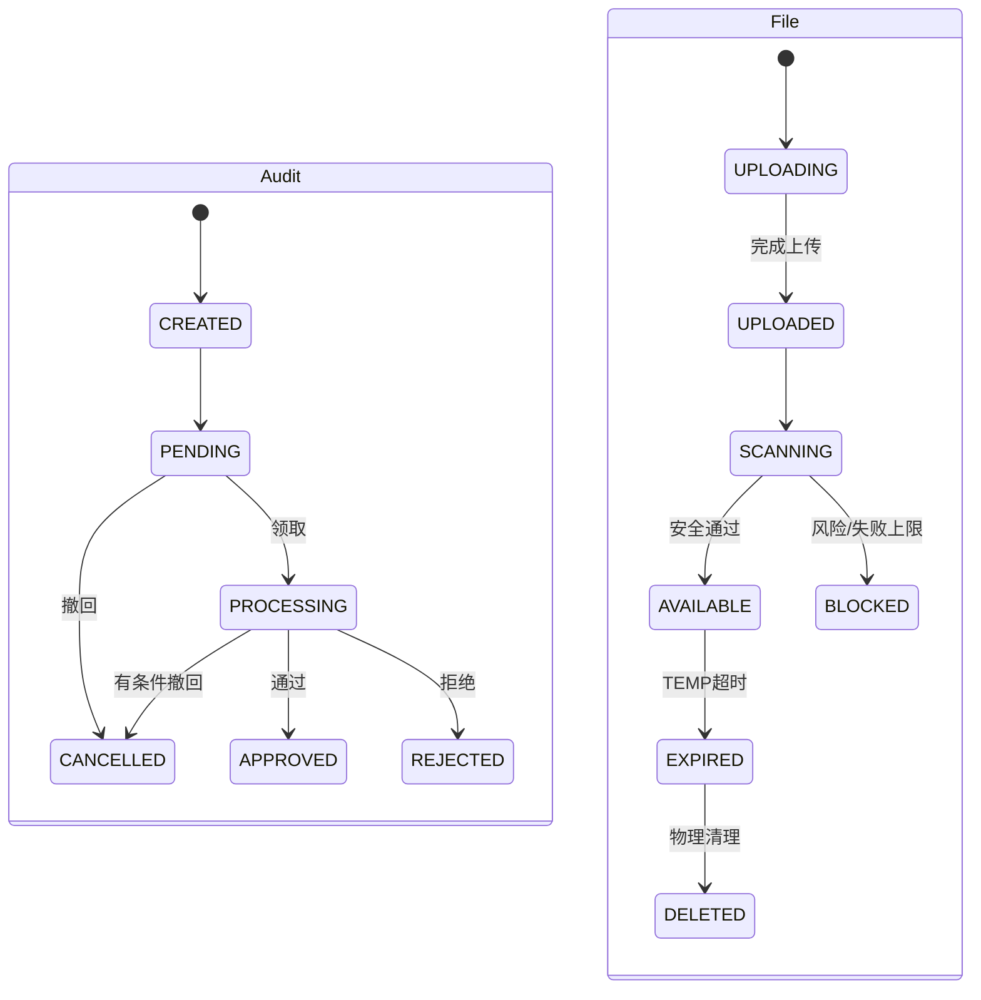

# TechNexus V1 详细设计文档

文档编号：`DES-DETAIL-001`  
版本：`v1.0`  
状态：`已基线化`  
设计负责人：`技术负责人`  
所属组件：`technexus-server 模块化单体`  
架构基线：`DES-ARCH-001@v0.3`

## 1 模块目标

把 REQ-SRS-001 v1.0 转换为可实现的模块、对象、事务、状态、缓存、异常和测试接缝。业务事实均落 MySQL；Redis、搜索投影和对象访问 URL 可重建。V1 不负责订单、支付、购买权益、视频转码或复杂即时通信。

后端实现基线为 **Java 21 LTS + Spring Boot 3 + DDD + 端口与适配器**。DDD 在这里同时包含战略设计（限界上下文及上下游关系）和战术设计（聚合、实体、值对象、领域服务、Repository 端口和领域事件），不是仅给表和 Service 改名。

## 2 模块分解与依赖



| 模块 | 职责 | 提供能力 | 允许依赖 | 生命周期 |
|---|---|---|---|---|
| `technexus-server` | Spring Boot 启动、HTTP 装配、配置/开关、作业、AI 防腐适配 | 运行入口和管理编排 | 所有模块公开 `api` | 进程/作业 |
| `technexus-common` | ID、UTC、Money、Problem、事件 envelope、Outbox/幂等技术契约 | Shared Kernel | 无业务模块 | 进程 |
| `technexus-auth` | 凭据、登录、会话、Token、认证限流 | Auth API/Principal | `technexus-common`、`technexus-user` 公开 API | 会话/凭据 |
| `technexus-user` | 用户、角色、权限、资料、授权策略 | User/Authorization API | `technexus-common` | 用户/角色 |
| `technexus-community` | 评论、标签、搜索投影、通知、推荐 | Community/Search/Notification API | `technexus-common` 事件、`technexus-user` 公开 API | 社区对象/投影 |
| `technexus-content` | 文章、帖子、问题、解决方案和版本 | ContentQuery/Command | `technexus-auth`、`technexus-user`、`technexus-file`、`technexus-audit`、`technexus-pricing` 公开端口 | Article/Post 聚合 |
| `technexus-demand` | 需求、方案、来源链 | Demand/Lineage API | `technexus-user`、`technexus-file`、`technexus-audit`、`technexus-pricing` 公开端口 | Demand 聚合 |
| `technexus-audit` | 审核任务和结果 | AuditCommand/Query | `technexus-user`、`technexus-common` | AuditTask 聚合 |
| `technexus-pricing` | 定价对象和历史 | PricingCommand/Query | `technexus-user`、`technexus-common` | PriceObject 聚合 |
| `technexus-file` | 上传、扫描、对象关系 | FileCommand/Access | `technexus-user`、`technexus-common` | FileObject/Relation |

禁止依赖：`domain → application/adapter`、业务模块之间的 Repository/Mapper/实体引用、Controller 直接调用 Repository、AI 适配器写业务事实。由 ArchUnit 规则和包可见性强制。

### 2.1 Spring Boot 工程与包映射

```text
com.technexus
├─ server                      # technexus-server：启动、装配、config/job/ai 子包
├─ common                      # technexus-common：稳定 Shared Kernel；禁止业务实体
├─ auth                        # technexus-auth
│  ├─ api                      # 对其他模块发布的应用接口和 DTO
│  ├─ application
│  │  ├─ command               # 用例编排、授权入口、事务边界
│  │  ├─ query                 # 只读查询模型
│  │  └─ port.out              # Repository/Token/RateLimit 端口
│  ├─ domain
│  │  ├─ model                 # Credential/AuthSession 聚合、实体、值对象
│  │  ├─ service               # 必须跨对象的纯领域规则
│  │  └─ event                 # 领域事件
│  └─ adapter
│     ├─ in.web                # REST/校验/DTO 映射；无业务分支
│     └─ out.persistence       # Spring Data/JDBC/JPA 模型与领域映射
├─ user                        # technexus-user；相同四层结构
├─ community                   # technexus-community；评论/标签/搜索/通知
├─ content                     # technexus-content；文章/帖子/版本
├─ demand                      # technexus-demand
├─ audit                       # technexus-audit
├─ pricing                     # technexus-pricing
└─ file                        # technexus-file
```

- `@SpringBootApplication` 仅位于 `com.technexus.server`；模块配置通过显式 configuration 装配。
- `@RestController`、`@Entity`/Mapper、Spring Data Repository 和外部 SDK 不得出现在 domain 包。
- `@Transactional` 位于 application command handler；领域对象不感知事务框架。
- 每个业务模块只公开 `api` 包；其他模块引用 `domain` 或 `adapter` 会被 ArchUnit/Spring Modulith 模块验证阻断。
- 查询侧可使用专用 projection/JdbcClient 读取本模块表或经批准的只读视图；命令侧必须加载聚合并调用领域行为。

### 2.2 聚合与事务边界

| 限界上下文 | 聚合根 | 聚合内成员/值对象 | 强制不变量 | Repository 端口 |
|---|---|---|---|---|
| Auth | Credential | PasswordHash、CredentialStatus、FailedAttempt | 密码仅保存 Argon2id Hash；停用后不可认证 | CredentialRepository |
| Auth | AuthSession | TokenHash、SessionStatus、TokenFamily | Refresh 单次轮换；重用撤销 family | AuthSessionRepository |
| User | User | UserStatus、sessionVersion、Profile | CANCELLED 终态；锁定/停用触发会话撤销 | UserRepository |
| User | Role | Permission、Scope | 权限标识唯一；角色变更递增策略版本 | RoleRepository |
| Community | Comment | ParentRef、CommentState | 删除父评论保留 tombstone/子回复 | CommentRepository |
| Community | Tag | TagName、Alias | 标准名唯一；合并后别名指向唯一目标 | TagRepository |
| Content | Article | ArticleVersion、Visibility、PublishedVersionRef | 待审版不覆盖线上版；目标版本匹配 | ArticleRepository |
| Content | Post | PostVersion、PostType、Visibility、PublishedVersionRef | POST/PROBLEM/SOLUTION 类型稳定；发布指针有效 | PostRepository |
| Demand | Demand | BudgetRange、QuoteSet、Deadline、Visibility | 状态合法；终态不收新方案 | DemandRepository |
| Demand | Proposal | Money、TechStack、Plan | provider 只能改自己的活动方案 | ProposalRepository |
| Demand | Lineage | TargetRef、LineageType | 无自环、无重复、限定深度无环 | LineageRepository |
| Audit | AuditTask | TargetVersionRef、Decision、ReasonCode | 人工决定一次且永久绑定版本 | AuditTaskRepository |
| Pricing | PriceObject | Money、PricingMode、EffectivePeriod | 最终价仅授权运营决定；历史追加 | PriceObjectRepository |
| File | FileObject | FileDigest、DetectedType、FileState | AVAILABLE 前不可授权下载 | FileObjectRepository |
| File | FileRelation | TargetRef、Visibility | 去重对象不共享访问权 | FileRelationRepository |

AI 建议属于 `technexus-server` 的应用/防腐适配记录，不作为独立 DDD 业务模块或同级工程。聚合之间只保存标识值，不保留跨聚合 ORM 对象引用。需要跨聚合验证时，应用服务先取得稳定快照，再调用聚合行为；最终一致的副作用发布领域事件。高并发 Comment、Proposal、AuthSession 和 FileRelation 独立成聚合，避免锁住 Article/Post/Demand/User/FileObject 大聚合。

### 2.3 应用服务、领域服务与事件规则

| 构件 | 可以做 | 禁止做 | 示例 |
|---|---|---|---|
| Controller/入站适配器 | 协议解析、Bean Validation、DTO 映射 | 状态判断、跨库写、授权结论 | `DemandController` |
| Application Command Handler | 用例编排、授权、事务、加载/保存聚合、发布事件 | 复制聚合状态机、直接改字段 | `SubmitDemandHandler` |
| Aggregate | 维护不变量、状态转换、产生领域事件 | 调外部 SDK/Repository、依赖 Spring | `Demand.confirmProposal()` |
| Domain Service | 无自然聚合归属的纯业务规则 | 基础设施调用、用例编排 | `LineageCyclePolicy` |
| Repository Port | 按聚合加载/保存、乐观版本 | 跨上下文联表返回他域实体 | `DemandRepository` |
| Outbound Adapter | JPA/JDBC、对象存储、AI/Token 实现 | 承担业务决策 | `JpaDemandRepository` |
| Domain Event | 表达已经发生的业务事实 | 携带 Token/联系方式/完整正文 | `DemandCompleted` |

领域事件先收集于聚合，由应用服务在同一数据库事务写入 Outbox。集成消费者只依赖版本化发布语言；事件重放不得绕过目标上下文的应用命令和聚合校验。

## 3 类型与对象设计



| 类型/类 | 职责 | 关键属性/方法 | 不变量 |
|---|---|---|---|
| User | 用户生命周期 | `activate/lock/disable/cancel` | 仅允许基线状态转换；CANCELLED 终态 |
| Credential | 认证凭据生命周期 | `replacePassword/disable/recordFailure` | 不保存明文；停用凭据不可恢复会话 |
| AuthSession | Refresh 轮换和撤销 | `rotate/revoke/isUsable` | 旧 Refresh 使用后即失效；Hash 唯一 |
| Article/Post | 线上版本指针与状态 | `submit/applyReview/offline` | 审核版本与目标版本一致；已发布正文不原地覆盖 |
| Demand | 需求状态和隐私 | `submit/approve/price/publish/transition` | 过期/取消/下架不收新方案 |
| AuditTask | 统一审核 | `claim/decide/cancel` | 决定一次；结果绑定 target_version_id |
| PriceObject | 当前价格 | `replaceWith` | 金额≥0、币种固定 CNY；每次变化写历史 |
| FileObject | 物理对象安全状态 | `uploaded/scan/block/expire` | AVAILABLE 前不可业务下载 |
| FileRelation | 业务授权 | `canAccess(principal)` | Hash 去重不共享关系权限 |
| Lineage | 闭环来源关系 | `connect(source,target)` | source+target+type 唯一；拒绝环路 |

## 4 核心流程设计

### 4.1 登录、刷新与全会话撤销



重复使用旧 Refresh 返回 `AUTH_REFRESH_REUSED` 并撤销该 token family。登录失败不泄露账号存在性。Redis 故障时使用应用实例内更严格限流并查询 MySQL 会话事实。

### 4.2 内容提交、审核和线上版本切换



若 targetVersion 已失配则拒绝决定并返回 `AUDIT_TARGET_VERSION_CONFLICT`；若审核拒绝，版本进入 REJECTED，作者修改产生新版本/新任务。免费模式直接 PUBLISHED，V1 的收费模式开关默认关闭。

### 4.3 问题到需求、方案和知识闭环



所有跨模块调用先做资源可见性与对象关系检查。闭环建立失败不回滚已完成需求，而是形成可重试 Outbox/运营待办；唯一键防止重复关系。

### 4.4 文件直传、扫描与授权下载



扫描失败保持 SCANNING 并重试 3 次，之后 BLOCKED 且生成运营待办；客户端声明 Hash 只用于预检，服务端扫描重新计算。

## 5 状态模型

### 5.1 账号



未列转换统一返回 `STATE_TRANSITION_INVALID`。LOCKED/DISABLED/CANCELLED 禁止新会话；锁定、停用、注销均撤销现有会话。

### 5.2 内容



### 5.3 需求



`REJECTED/COMPLETED/EXPIRED/CANCELLED/OFFLINE` 为 V1 终态；重新提交被拒需求需复制为新修订而非改写历史。

### 5.4 审核与文件



## 6 算法与业务逻辑

| 算法/规则 | 输入 | 输出 | 成本 | 边界 | 失败处理 |
|---|---|---|---|---|---|
| 对象授权 | principal, resource, action, scope | allow/deny | O(角色权限+参与关系) | 管理员仍需显式 scope | 默认拒绝/404 |
| 游标分页 | sortValue, publicId | nextCursor | O(log n + page) | pageSize 1..50 | 无效游标 400 |
| 热度排序 | 运营权重、互动、时间衰减 | score | 批处理 O(n) | 运营置顶优先 | 回退最新排序 |
| 闭环环路检测 | source,target,type | valid | V1 深度≤8 | 自环/重复 | 409 |
| 文件去重 | sha256,size,owner relation | object/relation | 索引 O(log n) | 同 Hash 不共享权限 | 创建独立关系 |
| 需求过期 | deadline/maxAge,state | EXPIRED/不变 | 分批扫描 | 仅 PUBLISHED/NEGOTIATING | 幂等重试 |

## 7 内部接口

| 接口 | 调用方 | 参数 | 返回 | 契约 | 异常 |
|---|---|---|---|---|---|
| `AuthorizationPort.check` | 全模块 | principal,target,action | decision | 默认拒绝；记录策略版本 | ACCESS_DENIED |
| `AuditPort.createTask` | `technexus-content`、`technexus-demand`、`technexus-file` | targetRef,version | taskId | 幂等键 target+version+type | TARGET_INVALID |
| `AuditDecisionPort.apply` | audit | targetVersion,decision | state | 期望版本匹配 | VERSION_CONFLICT |
| `FileAccessPort.verifyBindings` | `technexus-content`、`technexus-demand` | owner,relationIds | ok | AVAILABLE 且有权 | FILE_UNAVAILABLE |
| `PricingPort.confirm` | `technexus-pricing`、`technexus-demand` | target,money,reason | priceId | 操作者有权限、历史追加 | PRICE_CONFLICT |
| `LineagePort.connect` | `technexus-content`、`technexus-demand` | source,target,type | lineageId | 唯一、无环、有权可见 | LINEAGE_CONFLICT |
| `EventPublisher.enqueue` | 全模块 | event | eventId | 与业务事务同库提交 | DB_ERROR |

## 8 数据访问与事务

- 默认隔离级别 `READ COMMITTED`；状态转换使用 `version` 乐观锁，Refresh 轮换和领取审核任务使用短事务行锁。
- 单事务只修改一个业务模块所属表；跨模块通过 Outbox。`audit` 回调业务模块时携带目标版本并由目标模块独立提交。
- 幂等写接口需要 `Idempotency-Key`，保存主体、方法、路径、请求 Hash、响应摘要和 24 小时过期；同键不同请求返回 409。
- 锁顺序：聚合根 → 当前版本/子对象 → 历史/Outbox；批量操作按内部主键升序分块（≤100）避免死锁。
- 死锁/瞬时冲突仅对幂等事务最多重试 2 次，随机退避；业务冲突返回 409。

## 9 缓存设计

| 缓存项 | Key | Value | TTL | 更新/失效 | 一致性风险 |
|---|---|---|---:|---|---|
| 会话状态 | `sess:{sid}` | status,accountVersion | 5m | 撤销主动删除/写 deny | Redis 丢失回源 DB |
| 权限集合 | `perm:{user}:{rbacVersion}` | permissions | 10m | 角色变更递增版本 | 短暂陈旧由版本隔离 |
| 热点公开内容 | `content:pub:{id}:{ver}` | DTO | 5m | 发布/下架事件删 | 下架需同步删+DB兜底 |
| 系统参数 | `cfg:{key}:{version}` | typed value | 5m | 更新主动删 | 安全项服务端上下限 |
| 限流桶 | `rl:{dimension}:{hash}` | token bucket | 窗口+1m | 自然过期 | 故障用本地保守限流 |
| 幂等结果 | `idem-fast:{actor}:{key}` | response ref | 24h | DB 为事实 | 可回源 DB |

## 10 并发与异步处理

- Web 使用受界限线程池；文件/AI 不在请求线程读取大对象或等待长任务。
- Outbox Worker 每批 100，`FOR UPDATE SKIP LOCKED`，事件投递至少一次；消费者表以 event_id 唯一去重。
- 失败 1m/5m/30m 退避，最多 8 次；之后进入 FAILED 并展示管理待办，人工重放须审计。
- 定时过期/清理按游标分批 500，使用状态条件更新保证幂等。
- AI 与扫描使用独立小线程池和信号量；队列满返回 429/503，不挤占核心业务。

## 11 异常与错误处理

| 故障点 | 错误类型 | 对外表现 | 重试 | 降级/补偿 | 日志/告警 |
|---|---|---|---|---|---|
| 校验/状态 | 400/409 | RFC7807 Problem | 否 | 用户修正/刷新 | WARN，无敏感值 |
| 未认证/无权 | 401/403/404 | 最小泄露 | 刷新一次 | 重新登录 | 安全审计 |
| MySQL | 503 | 服务暂不可用 | 幂等请求有限 | 禁止伪成功 | ERROR+告警 |
| Redis | 受控降级 | 可能变慢/更严限流 | 后台恢复 | DB 回源 | WARN+指标 |
| 对象存储 | 503 | 上传/下载不可用 | 客户端退避 | 文本流程可继续 | ERROR+告警 |
| AI | 202 后失败状态 | 人工路径仍可用 | 手动/后台 | 不写事实 | 失败待办 |

统一错误字段：`type,title,status,code,detail,traceId,violations`；生产环境不返回堆栈、SQL、对象 Key 或其他用户资源存在性。

## 12 配置与特性开关

| 配置项 | 类型 | 默认值 | 敏感性 | 生效 | 回滚值 |
|---|---|---|---|---|---|
| `auth.access_ttl_minutes` | int 5..30 | 15 | 普通 | 动态/新令牌 | 15 |
| `auth.refresh_ttl_days` | int 1..30 | 30 | 普通 | 动态/新令牌 | 7 |
| `file.image_max_mb` | int 1..10 | 10 | 普通 | 动态 | 5 |
| `file.attachment_max_mb` | int 1..100 | 100 | 普通 | 动态 | 20 |
| `demand.max_valid_days` | int 1..90 | 30 | 普通 | 动态/新需求 | 30 |
| `feature.registration` | boolean | true | 高影响 | 动态 | false |
| `feature.ai_assist` | boolean | false | 高影响 | 动态 | false |
| `feature.paid_access` | boolean | false | 红线 | 启动+双确认 | false |
| `feature.video_upload` | boolean | false | 红线 | 不可在 V1 打开 | false |

## 13 日志、指标与审计

| 事件 | 日志字段 | 指标 | 告警 | 审计 |
|---|---|---|---|---|
| 登录/刷新失败 | trace,account_hash,ip_prefix,reason | auth_fail_total | 突增 | 是 |
| 状态转换 | aggregate,from,to,actor | transition_total | 非法突增 | 历史表 |
| 审核/定价 | target,version,decision,reason | queue_age | P95>24h | 永久 |
| 文件扫描 | file_id,result,duration | scan_fail/backlog | 不可用10m | 阻断记录 |
| Outbox | event,type,attempt | backlog/oldest | oldest>5m | 重放审计 |
| 备份 | set,size,hash,result | backup_age | >26h | 恢复记录 |

## 14 安全设计

- 所有命令在应用服务入口执行主体、动作、scope 和对象关系检查；批量操作逐项授权并返回部分结果。
- 富文本采用允许列表净化并在展示时启用 CSP；Markdown Mermaid/公式在隔离渲染策略下运行，禁用任意 HTML/脚本。
- 上传文件名仅作展示，存储 Key 由服务生成；下载必须通过 relation 鉴权，不接受客户端对象 Key。
- 管理员高风险操作要求 `X-Confirmation-Token`（5 分钟、绑定动作与资源）并考虑重新认证；服务端审计前后值的脱敏摘要。
- 密码使用 Argon2id（运行环境基准化参数）；敏感配置由文件/Secret 注入，日志与错误永不回显。

## 15 可测试性设计

- 时间、ID、对象存储、AI、扫描、事件发布均通过端口替换；状态机使用纯领域单元测试。
- Testcontainers 提供 MySQL/Redis/MinIO 集成环境；每个 Repository 验证唯一键、索引查询、锁和 UTC。
- ArchUnit 验证模块边界；OpenAPI 在 CI 解析并与控制器契约测试对照。
- 故障注入：Redis 丢失、对象存储超时、AI 无效 JSON、Outbox 重复、DB 死锁、扫描失败。
- 安全矩阵对每个对象用 owner/participant/other/reviewer/admin 身份测试页面与直接 API。

## 16 需求与测试映射

| 设计项 | 关联需求 | 预期单元测试 | 预期集成测试 |
|---|---|---|---|
| 会话轮换/撤销 | FR-ACC-01~03 | token family 状态 | 登录限流、旧 token 重用 |
| 策略授权 | FR-RBAC-01~04 | scope 决策表 | IDOR/管理员确认 |
| 内容版本/审核 | FR-CNT、FR-AUD | 转换与版本不变量 | 旧版持续展示、审核错位 |
| 需求/方案/闭环 | FR-DMD、FR-LOOP | 状态/无环规则 | 完整链路、过期竞态 |
| 定价 | FR-PRC | 金额/权限规则 | 历史不可覆盖、并发冲突 |
| 文件 | FR-FILE | 类型/状态规则 | 直传、扫描、关系授权 |
| 搜索/消息/运营 | FR-SCH、RCM、MSG、AIOPS、CFG | 排序/开关 | 投影重放、批量部分失败 |
| 运维护栏 | NFR-PERF、REL、OBS | 配置边界 | 压测、恢复、告警 |

## 17 未决事项

| 编号 | 问题 | 影响 | 责任人 | 计划日期 | 状态 |
|---|---|---|---|---|---|
| DD-OPEN-001 | 是否确认用户端采用 Nuxt 3 SSR/SSG、管理端保留 Vue 3/Vite SPA | 工程脚手架和部署进程 | 产品/技术负责人 | 02 阶段卡点 | 待确认 |
| DD-OPEN-002 | 是否确认 Alpha 初始容量护栏与 RPO/RTO 数值 | 压测、限流、备份验收 | 技术负责人 | 02 阶段卡点 | 待确认 |
| DD-OPEN-003 | 是否确认数据生命周期方案 | 删除任务、归档和表结构 | 产品负责人 | 02 阶段卡点 | 待确认 |

## 18 变更记录

| 日期 | 版本 | 变更 | 原因 |
|---|---|---|---|
| 2026-09-14 | v0.1 | 初始详细设计，覆盖依赖、领域、4 个关键时序和 4 组状态 | 02 设计阶段 |
| 2026-09-14 | v0.2 | 明确 Spring Boot + DDD 实现基线，增加代码包映射、聚合事务边界、构件职责和领域事件规则 | DES-USER-001 |
| 2026-09-14 | v0.3 | 按指定规范统一工程名、`com.technexus` 包树和 Article/Post/User 等聚合映射 | DES-USER-002 |
| 2026-09-14 | v1.0 | 用户通过第 3 轮设计门禁，无修改基线化 | 阶段通过 |
